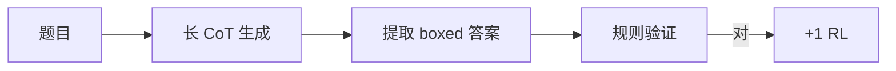

# 数学推理（GSM8K、MATH、AIME）

## 要解决的问题

LLM 在小学应用题到竞赛级数学上表现悬殊：会套模板却**算错中间步**、单位混淆、无法自我验证。数学推理是检验链式思维（CoT）、工具调用与测试时计算（第六部分）的标杆域，基准从 GSM8K 扩展到 MATH、AIME、Olympiad。

## 核心概念

| 基准 | 难度 | 答案形式 | 常用指标 |
| --- | --- | --- | --- |
| **GSM8K** | 小学多步 | 整数/有理数 | Acc（末行数字匹配） |
| **MATH** | 竞赛分类 | LaTeX | 分级 Acc |
| **MATH-500** | MATH 子集 | 同上 | 快速评测 |
| **AIME / AMC** | 美国竞赛 | 0–999 整数 | 近年推理模型主打 |
| **OlympiadBench** | 奥数 | 证明/构造 | 更难，人工多 |

**CoT 提示**（标准）：

$$
\text{Prompt} = \text{Question} + \text{``Let's think step by step''}
$$

**可验证奖励**（RLVR，见 [6.3.2](./../03-rl-reasoning/02-rlvr)）：答案 $y$ 与标准 $y^\*$ 经规则/parser 比对：

$$
r = \mathbb{1}[\text{normalize}(y) = \text{normalize}(y^\*)]
$$

## 方法 / 提升路径

1. **SFT on CoT**：高质量步骤数据（[4.1 SFT](../../04-post-training-alignment/01-sft/02-data-construction)）。
2. **测试时 compute**：采样多条链 + majority vote（[6.2.4 MCTS](./../02-test-time-compute/04-mcts)）。
3. **RL**：GRPO + 可验证奖励（[6.3.1 GRPO](./../03-rl-reasoning/01-grpo-rloo)、[DeepSeek-R1](./../02-test-time-compute/02-deepseek-r1)）。
4. **工具**：Python 解释器执行中间式（符号混合见 [6.1.3](./03-logical-symbolic-reasoning)）。

## 工程实践

- **评测**：固定 `temperature=0` 或 pass@k；报告 k=1/16/64。
- **解析器**：`\\boxed{}`、`\answer` 多模板；parser 错误会系统性低估模型。
- **成本**：AIME 级单题可消耗 10k+ thinking tokens（[6.2.5 Scaling](./../02-test-time-compute/05-inference-scaling-laws)）。

## 代表工作

- Cobbe et al., GSM8K；Hendrycks et al., MATH dataset
- OpenAI o1；DeepSeek-R1（[paper-reading 领读](/paper-reading/tech-report/deepseek/deepseek-r1)）
- 技术报告：[8.1.2 DeepSeek-R1](../../08-technical-reports/01-deepseek/02-deepseek-r1)

## 实践检查清单

- [ ] 固定评测/推理配置（温度、max_tokens、parser 版本）便于回归
- [ ] 记录硬件：GPU 型号、驱动、框架 commit
- [ ] 对比基线：未优化前 TTFT/TPOT 或 Acc
- [ ] 文档化失败案例：OOM、解析失败率、拒答率
- [ ] 交叉阅读本章「相关章节」避免孤立优化

## 局限与注意点

- 训练集与 **GSM8K/MATH 重叠** 导致分数虚高（[7.2.4 污染](../../07-evaluation/02-evaluation-methods/04-reliability-contamination)）。
- 纯自然语言 CoT 无保证逻辑正确；需 RLVR 或工具。
- 中文竞赛（CMATH 等）见 [7.1.3 中文基准](../../07-evaluation/01-benchmarks/03-multilingual-chinese-benchmarks)。

## 延伸阅读

- 本仓库 [LLMs 入口](/llms/intro) 可回溯全局大纲；修改单点优化前建议先读上下游章节链接。
- 技术报告精读见 `llms/08-technical-reports/` 与 [paper-reading](/paper-reading/) 专栏。
- 工程复现优先锁定：框架版本 + 量化格式 + 评测 harness commit，三者缺一即难以对齐论文数字。

## 相关章节

- 同章：[6.1.2 代码](./02-code-reasoning) · [6.1.3 逻辑](./03-logical-symbolic-reasoning) · [6.1.4 瓶颈](./04-multi-step-bottleneck)
- 测试时：[6.2.1 o1](./../02-test-time-compute/01-o1-o3-paradigm) · [6.2.2 R1](./../02-test-time-compute/02-deepseek-r1)
- 评估：[7.1.2 推理基准](../../07-evaluation/01-benchmarks/02-reasoning-benchmarks)
