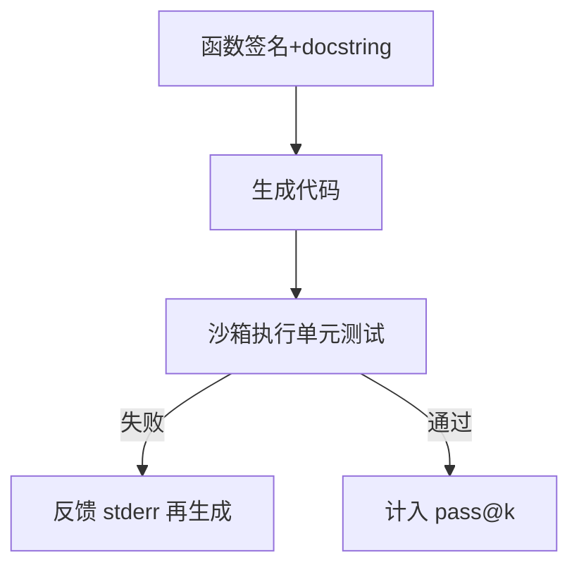

# 6.1.2 代码推理与执行

## 要解决的问题

代码任务要求 **语法正确、算法逻辑对、通过隐藏测试**。LLM 可生成看似合理但 failing unit tests 的程序；需结合 CoT、自我调试、执行反馈与仓库级基准（HumanEval → SWE-bench）系统评估。

## 核心概念

| 基准 | 粒度 | 执行 | 指标 |
| --- | --- | --- | --- |
| **HumanEval** | 单函数补全 | sandbox | pass@k |
| **MBPP** | 基础编程题 | 同上 | pass@1 |
| **LiveCodeBench** | 持续更新题 | 防污染 | pass@1 |
| **SWE-bench** | 真实 GitHub issue | Docker 仓库 | resolve rate |
| **BigCodeBench** | 库 API 调用 | 多步 | 更难 |

**pass@k**（Chen et al.）：

$$
\text{pass@k} = \mathbb{E}_{\text{tasks}}\left[ 1 - \frac{\binom{n-c}{k}}{\binom{n}{k}} \right]
$$

$n$ 为采样数，$c$ 为通过样本数。

## 方法 / 能力提升

1. **Fill-in-middle** 预训练（见 [3.3.4 FIM](../../03-pre-training/03-pretraining-objectives/04-fim)）提升补全。
2. **执行反馈 RL**：单元测试结果作 reward（与 [6.3.2 RLVR](./../03-rl-reasoning/02-rlvr) 同族）。
3. **Agent 环**：读仓库、改多文件、跑 pytest（SWE-agent 类，链 [7.1.5 Agent 基准](../../07-evaluation/01-benchmarks/05-agent-benchmarks)）。
4. **测试时**：多采样 + 选通过测试的样本；或 [6.2.4 MCTS](./../02-test-time-compute/04-mcts) 在 token 空间搜索。

## 工程实践

- **沙箱**：Docker/firejail 禁网；限时防死循环。
- **推理部署**：代码场景低 temperature（[5.1.2](../../05-inference-deployment/01-inference-basics/02-sampling-strategies)）。
- **评测**：HumanEval 已高度饱和，新模型应报 LiveCodeBench + SWE-bench Verified。

## 代表工作

- Chen et al., *Evaluating Large Language Models Trained on Code*（HumanEval）
- Jimenez et al., SWE-bench
- DeepSeek-Coder、Qwen2.5-Coder 技术报告

## 实践检查清单

- [ ] 固定评测/推理配置（温度、max_tokens、parser 版本）便于回归
- [ ] 记录硬件：GPU 型号、驱动、框架 commit
- [ ] 对比基线：未优化前 TTFT/TPOT 或 Acc
- [ ] 文档化失败案例：OOM、解析失败率、拒答率
- [ ] 交叉阅读本章「相关章节」避免孤立优化

## 局限与注意点

- pass@1 方差大；论文应报 pass@10 或 pass@100 与 n。
- SWE-bench **环境漂移**（依赖版本）导致复现难。
- 代码泄露进预训练污染 HumanEval（[7.2.4](../../07-evaluation/02-evaluation-methods/04-reliability-contamination)）。

## 术语速记

正文英文术语与开源实现（GitHub、Hugging Face）命名一致，便于检索源码与 Issue。

## 延伸阅读

- 本仓库 [LLMs 入口](/llms/intro) 可回溯全局大纲；修改单点优化前建议先读上下游章节链接。
- 技术报告精读见 `llms/08-technical-reports/` 与 [paper-reading](/paper-reading/) 专栏。
- 工程复现优先锁定：框架版本 + 量化格式 + 评测 harness commit，三者缺一即难以对齐论文数字。

## 相关章节

- 同章：[6.1.1 数学](./01-mathematical-reasoning) · [6.1.4 多步瓶颈](./04-multi-step-bottleneck)
- RL：[6.3.1 GRPO](./../03-rl-reasoning/01-grpo-rloo) · [6.3.2 RLVR](./../03-rl-reasoning/02-rlvr)
- 评估：[7.1.2](../../07-evaluation/01-benchmarks/02-reasoning-benchmarks)
