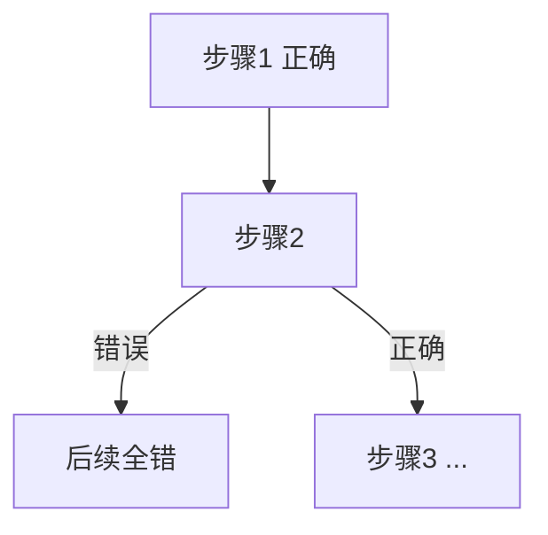

# 多步推理的瓶颈

## 要解决的问题

复杂任务需 **10+ 推理步**，错误常出现在中间某步（error propagation），且每步消耗 token 与延迟。识别瓶颈有助于选择：更强基座、PRM 引导、测试时搜索、还是工具/人类介入。

## 核心概念

**错误传播**：设每步独立正确率 $p$，$T$ 步后端到端成功率：

$$
P_{\text{success}} \approx p^T
$$

即使 $p=0.95$，$T=20$ 时 $P \approx 0.36$。相关性存在时更差。

| 瓶颈 | 表现 | 缓解方向 |
| --- | --- | --- |
| **规划** | 走错分支 | MCTS / ToT（[6.2.4](./../02-test-time-compute/04-mcts)） |
| **算术/符号** | 中间算错 | RLVR、计算器（[6.1.1](./01-mathematical-reasoning)） |
| **记忆** | 遗忘前提 | 长上下文、草稿纸外部记忆 |
| **停止过早** | 未验证 | 强制 reflection 步（o1 类） |
| **成本** | token 爆炸 | 推理 scaling 预算（[6.2.5](./../02-test-time-compute/05-inference-scaling-laws)） |

## 方法 / 诊断与改进

1. **步级标注**：人工标错步位置；训练 **PRM**（[6.2.3](./../02-test-time-compute/03-prm-vs-orm)）。
2. **Best-of-N**：采样 N 条完整链，ORM/验证器选最优（测试时 compute）。
3. **分解**：Least-to-most、子问题调用（`docs/` 任务分解）。
4. **自我修正**：生成后 critic 再改（Constitutional / 自博弈 [6.3.4](./../03-rl-reasoning/04-self-play)）。

## 工程实践

- **日志**：记录每步 hidden 或至少文本步编号，便于定位失败层。
- **预算**：Agent 设 `max_reasoning_tokens` 与 wall time（[5.1.3](../../05-inference-deployment/01-inference-basics/03-repetition-length-control)）。
- **评测**：除最终 Acc 外报 **步级准确率**（若有标注）。

## 代表工作

- Wei et al., Chain-of-Thought；Yao et al., Tree of Thoughts
- Lightman et al., *Let's Verify Step by Step*（PRM800K）
- OpenAI o1 系统卡（隐藏推理步）

## 实践检查清单

- [ ] 固定评测/推理配置（温度、max_tokens、parser 版本）便于回归
- [ ] 记录硬件：GPU 型号、驱动、框架 commit
- [ ] 对比基线：未优化前 TTFT/TPOT 或 Acc
- [ ] 文档化失败案例：OOM、解析失败率、拒答率
- [ ] 交叉阅读本章「相关章节」避免孤立优化

## 局限与注意点

- $p^T$ 模型过简；模型可在后步 **自我纠正**，亦可能巩固错误。
- 更长 CoT 不保证更高 Acc（DeepSeek-R1 报告中有无效反思，见 [paper-reading R1](/paper-reading/tech-report/deepseek/deepseek-r1)）。
- 多步 Agent 评测见 [7.1.5](../../07-evaluation/01-benchmarks/05-agent-benchmarks)。

## 术语速记

正文英文术语与开源实现（GitHub、Hugging Face）命名一致，便于检索源码与 Issue。

## 延伸阅读

- 本仓库 [LLMs 入口](/llms/intro) 可回溯全局大纲；修改单点优化前建议先读上下游章节链接。
- 技术报告精读见 `llms/08-technical-reports/` 与 [paper-reading](/paper-reading/) 专栏。
- 工程复现优先锁定：框架版本 + 量化格式 + 评测 harness commit，三者缺一即难以对齐论文数字。

## 相关章节

- 同章：[6.1.1](./01-mathematical-reasoning) · [6.1.2](./02-code-reasoning) · [6.1.3](./03-logical-symbolic-reasoning)
- 测试时：[6.2 全章](./../02-test-time-compute/01-o1-o3-paradigm)
- RL：[6.3.3 长 CoT](./../03-rl-reasoning/03-long-cot-training)
