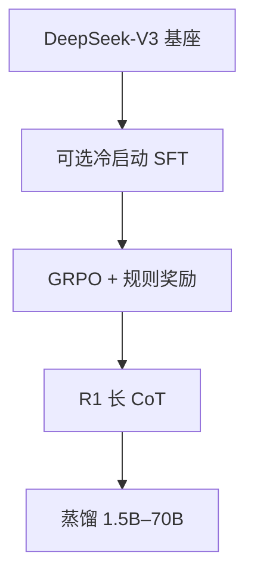

# DeepSeek-R1 与开源推理模型

## 要解决的问题

o1 闭源后，社区需要可复现的 **长链推理 + RL** 配方与权重。DeepSeek-R1 用 **纯强化学习**（以 GRPO 为主）在基座上激发自我验证、反思、长 CoT，并开源 R1、R1-Zero、蒸馏版，带动 QwQ、Marco-o1、Open-R1 等生态。

## 核心概念

| 模型 | 说明 |
| --- | --- |
| **DeepSeek-R1-Zero** | 跳过 SFT，纯 RL，可读性较差 |
| **DeepSeek-R1** | 冷启动 SFT + RL，平衡可读与性能 |
| **R1-Distill** | 大模型 CoT 蒸馏到小模型（Qwen/Llama） |

**GRPO 目标**（见 [6.3.1](./../03-rl-reasoning/01-grpo-rloo)）：组内相对优势，无需单独 Critic：

$$
\mathcal{L}_{\text{GRPO}} \approx -\mathbb{E}\left[ \frac{\pi_\theta}{\pi_{\text{old}}} \hat{A}_i - \beta \text{KL}(\pi_\theta \| \pi_{\text{ref}}) \right]
$$

**可验证奖励**：数学/代码答案正确则 $r=1$，驱动长推理涌现。

## 方法 / 训练要点（论文级）

1. **冷启动**：少量长 CoT SFT 稳定格式（`` 等模板）。
2. **RL 阶段**：多采样 rollout，规则验证器给 reward；KL 约束防偏离基座。
3. **语言混合**：RL 中出现中英混杂，需后续 SFT 修复（论文 ablation）。
4. **蒸馏**：强模型生成数据，小模型 SFT 获部分推理力（[5.4.2 蒸馏](../../05-inference-deployment/04-model-compression/02-knowledge-distillation)）。

## 工程实践

- **部署**：HF `deepseek-ai/DeepSeek-R1`；vLLM 支持长上下文与 thinking 解析。
- **成本**：单题 8k–32k 输出常见；配合 [5.2.4 Prefix cache](../../05-inference-deployment/02-kv-cache-attention-optimization/04-prefix-prompt-caching)。
- **评测**：AIME 2024、MATH-500、LiveCodeBench；固定采样与 extractor。

## 代表工作

- DeepSeek-AI, *DeepSeek-R1: Incentivizing Reasoning Capability in LLMs via Reinforcement Learning*
- 本仓库 **深度领读**：[DeepSeek-R1 论文领读](/paper-reading/tech-report/deepseek/deepseek-r1)
- 大纲摘要：[8.1.2 DeepSeek-R1 技术报告](../../08-technical-reports/01-deepseek/02-deepseek-r1)

:::tip 学习路径

架构表、训练时间线与个人拆解以 [paper-reading 领读](/paper-reading/tech-report/deepseek/deepseek-r1) 为准；本节为第六部分推理专题速查。

:::

## 实践检查清单

- [ ] 固定评测/推理配置（温度、max_tokens、parser 版本）便于回归
- [ ] 记录硬件：GPU 型号、驱动、框架 commit
- [ ] 对比基线：未优化前 TTFT/TPOT 或 Acc
- [ ] 文档化失败案例：OOM、解析失败率、拒答率
- [ ] 交叉阅读本章「相关章节」避免孤立优化

## 局限与注意点

- R1-Zero **可读性差**，产品用 R1 主版本。
- 纯 RL 幻觉仍存在；需拒绝采样与安全对齐（第四部分）。
- 蒸馏小模型上限低于 R1 本体的 AIME 分数。

## 延伸阅读

- 本仓库 [LLMs 入口](/llms/intro) 可回溯全局大纲；修改单点优化前建议先读上下游章节链接。
- 技术报告精读见 `llms/08-technical-reports/` 与 [paper-reading](/paper-reading/) 专栏。
- 工程复现优先锁定：框架版本 + 量化格式 + 评测 harness commit，三者缺一即难以对齐论文数字。

## 相关章节

- 同章：[6.2.1 o1](./01-o1-o3-paradigm) · [6.3.1 GRPO](./../03-rl-reasoning/01-grpo-rloo) · [6.3.2 RLVR](./../03-rl-reasoning/02-rlvr)
- 数学：[6.1.1 GSM8K/MATH](./../01-complex-reasoning/01-mathematical-reasoning)
- 评估：[7.1.2](../../07-evaluation/01-benchmarks/02-reasoning-benchmarks)
