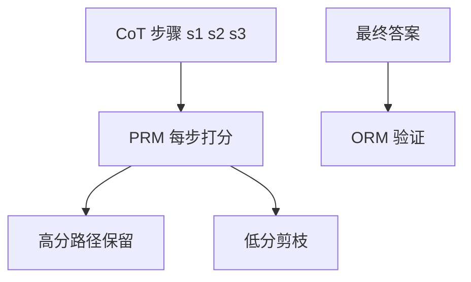

# 过程奖励模型（PRM）vs 结果奖励模型（ORM）

## 要解决的问题

长链推理需知道 **哪一步错了** 才能搜索或 RL 信用分配。**ORM** 只对最终答案打分；**PRM** 对每个中间步打分，支撑 Best-of-N、MCTS、RL 细粒度奖励。o1/R1 类系统可能组合二者，开源社区以 PRM800K 为代表。

## 核心概念

| 类型 | 输入 | 输出 | 用途 |
| --- | --- | --- | --- |
| **ORM** | 完整解 | 对/错或标量 | Best-of-N 选优、RL 稀疏奖励 |
| **PRM** | 前缀 + 当前步 | 步级 $r_t \in [0,1]$ | 束搜索、MCTS、步级 RL |

**Best-of-N（ORM）**：

$$
y^\* = \arg\max_{y^{(i)}, i=1..N} R_{\text{ORM}}(y^{(i)})
$$

**PRM 引导搜索**：扩展节点 $s$ 时优先 $V(s) = \sum_{t} r_t$ 或 $\prod_t r_t$ 高的分支。

训练数据（Lightman et al.）：

- 人工标 **每步** 正确/中性/错误 → PRM。
- 仅末行答案 → ORM（便宜但信息少）。

## 方法 / 实践

1. **数据**：MATH/GSM 生成多解，人工或强模型标步级标签（PRM800K）。
2. **架构**：在基座上加 value head；输入 `(problem, step_1..step_t)`。
3. **推理**：与 [6.2.4 MCTS](./04-mcts) 或 beam search 结合；计算成本高于纯采样。
4. **RL**：稀疏 ORM + 稠密 PRM 混合 reward shaping（待验证：R1 是否用显式 PRM）。

## 工程实践

- **ORM 便宜**：规则验证器（[6.3.2 RLVR](./../03-rl-reasoning/02-rlvr)）是零成本 ORM。
- **PRM 部署**：额外 GPU 跑 value model；延迟增加。
- **评测**：报告 PRM 在 ProcessBench 上的 step-level AUC。

## 代表工作

- Lightman et al., *Let's Verify Step by Step*（OpenAI PRM800K）
- Wang et al., *Math-Shepherd*（自动过程标签）
- Uesato et al., *Solving Math Word Problems with Process- and Outcome-Based Feedback*

## 实践检查清单

- [ ] 固定评测/推理配置（温度、max_tokens、parser 版本）便于回归
- [ ] 记录硬件：GPU 型号、驱动、框架 commit
- [ ] 对比基线：未优化前 TTFT/TPOT 或 Acc
- [ ] 文档化失败案例：OOM、解析失败率、拒答率
- [ ] 交叉阅读本章「相关章节」避免孤立优化

## 局限与注意点

- PRM **分布外** 步骤打分不可靠；需与生成模型同族或联合训练。
- 自动步级标签噪声大，会误导搜索。
- ORM-only 的 pass@k 已很强，PRM 收益依任务而异（个人理解：数学>闲聊）。

## 延伸阅读

- 本仓库 [LLMs 入口](/llms/intro) 可回溯全局大纲；修改单点优化前建议先读上下游章节链接。
- 技术报告精读见 `llms/08-technical-reports/` 与 [paper-reading](/paper-reading/) 专栏。
- 工程复现优先锁定：框架版本 + 量化格式 + 评测 harness commit，三者缺一即难以对齐论文数字。

## 相关章节

- 同章：[6.2.4 MCTS](./04-mcts) · [6.2.1 o1](./01-o1-o3-paradigm)
- 瓶颈：[6.1.4 多步](./../01-complex-reasoning/04-multi-step-bottleneck)
- RLHF RM：[4.3.2 奖励模型](../../04-post-training-alignment/03-rlhf/02-reward-model)
