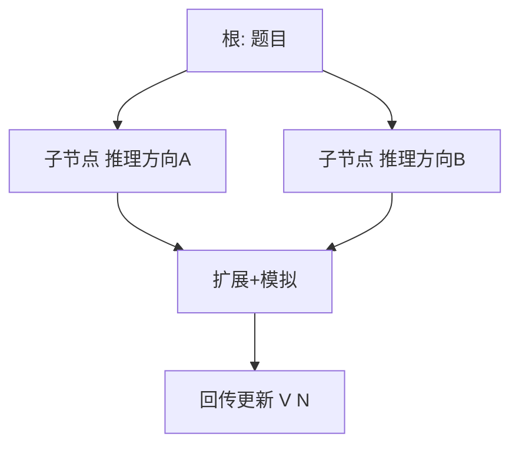

# 蒙特卡洛树搜索（MCTS）在 LLM 中的应用

## 要解决的问题

贪心解码每步只走 **一条** 局部最优路径；复杂推理需探索多条中间思路。MCTS 在棋类中成功，被移植到 LLM：**token/步/段落** 为动作，PRM/ORM 为价值，在有限预算内扩展高潜力分支（Tree of Thoughts、RAP、AlphaCode 等）。

## 核心概念

经典 MCTS 四步：**Select → Expand → Simulate → Backpropagate**。

在 LLM 中常见映射：

| 棋类 | LLM |
| --- | --- |
| 局面 | 当前已生成前缀 |
| 着法 | 下一 chunk / 推理步 |
| 终局价值 | ORM 或 PRM 累积 |
| rollout policy | 模型采样 |

**UCT 选择**（节点 $s$，子节点 $s'$）：

$$
UCT(s') = V(s') + c \sqrt{\frac{\ln N(s)}{N(s')}}
$$

$V$ 来自 [6.2.3 PRM](./03-prm-vs-orm) 或 rollout 末值，$N$ 为访问次数。

## 方法 / 与 Best-of-N 对比

| 方法 | 探索结构 | 计算 | 适用 |
| --- | --- | --- | --- |
| Best-of-N | N 条独立完整链 | $N \times L$ | 简单好用 |
| Beam | 宽度固定 | 中等 | 翻译传统 |
| **MCTS** | 自适应树 | 高（需多次 forward） | 难逻辑/数学 |

实现要点：

1. 限制 **深度/宽度/模拟次数** 防 token 爆炸。
2. 用强模型作 rollout，弱模型作 policy（待验证成本权衡）。
3. 叶节点用规则验证（[6.3.2 RLVR](./../03-rl-reasoning/02-rlvr)）剪枝。

## 工程实践

- 延迟远超单次生成（[5.1.4](../../05-inference-deployment/01-inference-basics/04-latency-metrics)）；仅用于离线或高价值 query。
- 缓存树节点 KV（[5.2.4 Prefix](../../05-inference-deployment/02-kv-cache-attention-optimization/04-prefix-prompt-caching)）可复用公共前缀。
- 开源：reasoning-mcts、LATS 等 repo 可作原型。

## 代表工作

- Yao et al., *Tree of Thoughts: Deliberate Problem Solving with Large Language Models*
- Hao et al., *Reasoning with Language Model is Planning with World Model*（RAP）
- Silver et al. AlphaGo（背景）；AlphaCode 采样+过滤

## 实践检查清单

- [ ] 固定评测/推理配置（温度、max_tokens、parser 版本）便于回归
- [ ] 记录硬件：GPU 型号、驱动、框架 commit
- [ ] 对比基线：未优化前 TTFT/TPOT 或 Acc
- [ ] 文档化失败案例：OOM、解析失败率、拒答率
- [ ] 交叉阅读本章「相关章节」避免孤立优化

## 局限与注意点

- MCTS 超参敏感；论文结果难在 production 复现。
- PRM 质量决定上限；差 PRM 会系统性偏向错误分支。
- 与 [6.2.5 推理 Scaling](./05-inference-scaling-laws) 结合：树宽是 compute 预算之一。

## 相关章节

- 同章：[6.2.3 PRM/ORM](./03-prm-vs-orm) · [6.2.5 Scaling](./05-inference-scaling-laws)
- 瓶颈：[6.1.4](./../01-complex-reasoning/04-multi-step-bottleneck)
- 数学：[6.1.1](./../01-complex-reasoning/01-mathematical-reasoning)
