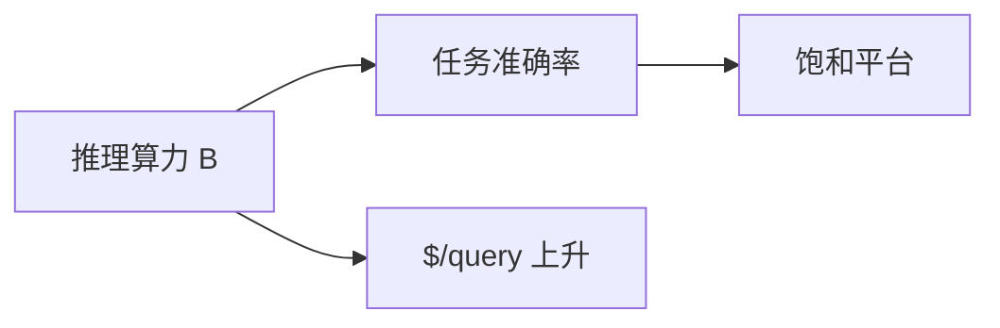

# 6.2.5 推理时 Scaling Laws

## 要解决的问题

预训练有 Chinchilla 律：$N$、$D$、$C$ 如何分配。推理时代兴起 **「花更多测试时算力换准确率」** 的新曲线：采样数 $N$、思维链长度 $L$、搜索宽度 $W$ 与任务成功率的关系是否可预测？对容量规划与产品定价至关重要。

## 核心概念

**预训练**（回顾 [3.4.2 Chinchilla](../../03-pre-training/04-scaling-laws/02-chinchilla-scaling-laws)）：

$$
L \approx A/N^\alpha + B/D^\beta + L_0
$$

**推理时**（经验形式，多种拟合，标注 **待验证**）：

$$
\text{Acc}(B) \approx a - b \cdot e^{-c B}, \quad B \in \{N_{\text{samples}}, L_{\text{think}}, W_{\text{MCTS}}\}
$$

| 预算轴 | 操作 | 典型观测 |
| --- | --- | --- |
| **Sample budget** | Best-of-N、self-consistency | 边际收益递减 |
| **Length budget** | o1/R1 thinking tokens | 过长反降（无效反思） |
| **Search budget** | MCTS 节点数 | 依赖 PRM 质量 |
| **Verifier** | 强 ORM/代码执行 | 可换算为有效 $N$ |

## 方法 / 如何测量

1. 固定模型 checkpoint，扫 $N \in \{1,4,16,64\}$ 或 `reasoning_effort`。
2. 记录 **Acc vs 总 FLOPs / 总 output tokens**（双轴）。
3. 分任务层：GSM8K vs AIME 斜率不同（[6.1.1](./../01-complex-reasoning/01-mathematical-reasoning)）。
4. 对比训练算力：Snell et al. *Scaling LLM Test-Time Compute* 提出最优分配训练 vs 推理。

## 工程实践

- **产品**：按「推理努力」分档计费，对齐边际成本。
- **路由**：简单分类器预测所需 $B$，避免一律 max thinking（[5.6.3](../../05-inference-deployment/06-inference-serving/03-scheduling-load-balancing)）。
- **SLA**：报告 p50/p90 **总 tokens** 含 hidden thinking。

## 代表工作

- Snell et al., *Scaling LLM Test-Time Compute Optimally can be More Effective than Scaling Model Parameters*
- OpenAI o1 技术博客；DeepSeek-R1 附录 scaling 图
- Jones, *Scaling Scaling Laws*（背景）

## 实践检查清单

- [ ] 固定评测/推理配置（温度、max_tokens、parser 版本）便于回归
- [ ] 记录硬件：GPU 型号、驱动、框架 commit
- [ ] 对比基线：未优化前 TTFT/TPOT 或 Acc
- [ ] 文档化失败案例：OOM、解析失败率、拒答率
- [ ] 交叉阅读本章「相关章节」避免孤立优化

## 局限与注意点

- 不同任务、提示词下曲线 **不可互推**。
- 闭源 o1 的 thinking token 数不透明，难以复现律。
- 与 [5.5 推测解码](../../05-inference-deployment/05-accelerated-decoding/01-speculative-decoding) 正交：后者降延迟不改变采样分布。

## 延伸阅读

- 本仓库 [LLMs 入口](/llms/intro) 可回溯全局大纲；修改单点优化前建议先读上下游章节链接。
- 技术报告精读见 `llms/08-technical-reports/` 与 [paper-reading](/paper-reading/) 专栏。
- 工程复现优先锁定：框架版本 + 量化格式 + 评测 harness commit，三者缺一即难以对齐论文数字。

## 相关章节

- 同章：[6.2.1 o1](./01-o1-o3-paradigm) · [6.2.2 R1](./02-deepseek-r1) · [6.2.4 MCTS](./04-mcts)
- 预训练律：[3.4 Scaling Laws](../../03-pre-training/04-scaling-laws/01-kaplan-scaling-laws)
- 延迟：[5.1.4](../../05-inference-deployment/01-inference-basics/04-latency-metrics)
