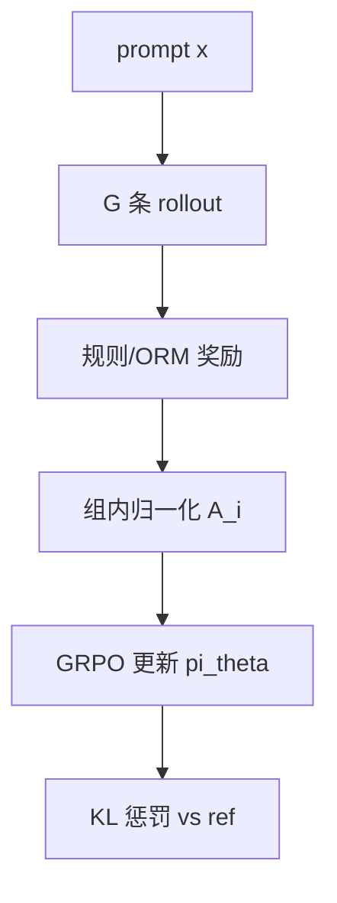

# 6.3.1 GRPO、RLOO 等算法

## 要解决的问题

推理 RL 需对同一 prompt **采样多条 rollout**，传统 PPO 要训练大 Critic，显存与稳定性成本高。**GRPO**（Group Relative Policy Optimization）用组内相对奖励代替 Critic；**RLOO**（REINFORCE Leave-One-Out）用 leave-one-out baseline 降方差。DeepSeek-R1 使 GRPO 成为开源推理 RL 默认选项。

## 核心概念

**PPO 剪切目标**（回顾 [4.3.3 PPO](../../04-post-training-alignment/03-rlhf/03-ppo)）：

$$
\mathcal{L}^{\text{CLIP}} = \mathbb{E}\left[\min\left(r_t(\theta)\hat{A}_t,\ \text{clip}(r_t(\theta),1-\epsilon,1+\epsilon)\hat{A}_t\right)\right]
$$

**GRPO**：对 prompt $x$ 采样一组输出 $\{y_i\}_{i=1}^G$，奖励 $\{r_i\}$，组内标准化优势：

$$
\hat{A}_i = \frac{r_i - \text{mean}(\{r_j\})}{\text{std}(\{r_j\}) + \delta}
$$

无需 $V_\phi(x)$ Critic，省显存。

**RLOO baseline**（对样本 $i$）：

$$
\hat{A}_i^{\text{RLOO}} = r_i - \frac{1}{G-1}\sum_{j \neq i} r_j
$$

| 算法 | Critic | 组采样 | R1 使用 |
| --- | --- | --- | --- |
| PPO | 需要 | 可选 | 传统 RLHF |
| **GRPO** | 不需要 | 必须 | ✓ 主路径 |
| **RLOO** | 不需要 | 必须 | 可选替代 |
| DPO | 隐式 | 成对偏好 | 非 on-policy RL |

## 方法 / 训练循环

1. 从策略 $\pi_\theta$ 采样 $G$ 条完整响应（含长 CoT）。
2. 计算 $r_i$（[6.3.2 RLVR](./02-rlvr) 规则验证）。
3. 算 $\hat{A}_i$，PPO-clip 或 REINFORCE 式更新。
4. 加 $\beta \text{KL}(\pi_\theta \| \pi_{\text{ref}})$（[4.3.4 KL 稳定](../../04-post-training-alignment/03-rlhf/04-kl-penalty-stability)）。
5. 重复多个 epoch；监控熵 collapse 与格式违规率。

## 工程实践

- **框架**：OpenRLHF、veRL、DeepSpeed-Chat；多卡 rollout 与训练分离。
- **G 大小**：8–64；越大方差估计越稳，算力越高。
- **长度**：长 CoT 使 rollout 显存爆炸，需 [3.5 序列并行](../../03-pre-training/05-distributed-training/05-three-d-sequence-parallelism) 或截断策略。

## 代表工作

- Shao et al., *DeepSeekMath: Pushing the Limits of Mathematical Reasoning in Open Language Models*（GRPO 系统阐述）
- Ahmadian et al., RLOO；Schulman et al., PPO
- DeepSeek-R1（[paper-reading](/paper-reading/tech-report/deepseek/deepseek-r1)）

## 实践检查清单

- [ ] 固定评测/推理配置（温度、max_tokens、parser 版本）便于回归
- [ ] 记录硬件：GPU 型号、驱动、框架 commit
- [ ] 对比基线：未优化前 TTFT/TPOT 或 Acc
- [ ] 文档化失败案例：OOM、解析失败率、拒答率
- [ ] 交叉阅读本章「相关章节」避免孤立优化

## 局限与注意点

- 组内 $G$ 过小 → 优势估计噪声大，训练抖动。
- 全错/全对组梯度为零，需 curriculum 或难度过滤。
- 与 [4.4 DPO](../../04-post-training-alignment/04-preference-optimization/01-dpo) 相比 on-policy 成本高但更适合稀疏可验证奖励；**OPD/OPSD** 在同为 on-policy 时用教师或标准解提供稠密 token 监督，常与 RLVR 串联（见 [4.3.6 OPD](../../04-post-training-alignment/03-rlhf/06-on-policy-distillation)）。

## 相关章节

- 同章：[6.3.2 RLVR](./02-rlvr) · [6.3.3 长 CoT](./03-long-cot-training) · [6.3.4 自博弈](./04-self-play)
- 产品：[6.2.2 DeepSeek-R1](./../02-test-time-compute/02-deepseek-r1)
- RLHF：[4.3.1 流程](../../04-post-training-alignment/03-rlhf/01-rlhf-pipeline) · [4.3.6 OPD](../../04-post-training-alignment/03-rlhf/06-on-policy-distillation)
