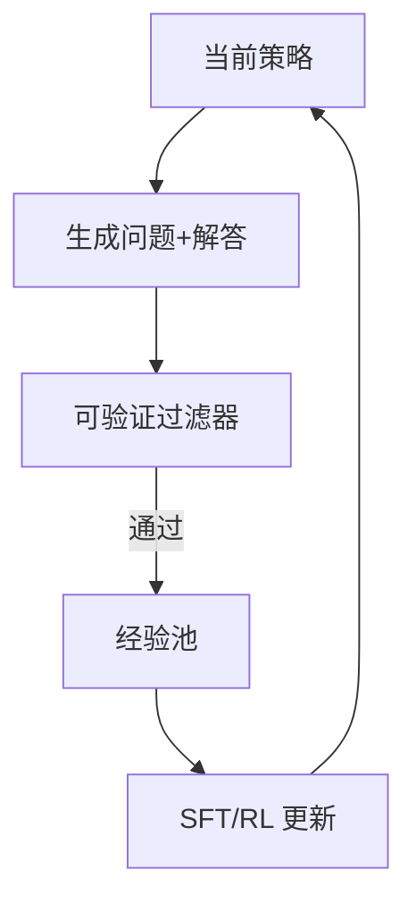

# 6.3.4 自我博弈与自我改进

## 要解决的问题

可验证领域（数学、代码、棋类）中，模型可 **自己出题、解题、判分**，在无人工标注下迭代变强。自我博弈（self-play）与自我改进（self-improvement）将 RLVR 扩展为 **闭环数据飞轮**，与 [5.4.2 蒸馏](../../05-inference-deployment/04-model-compression/02-knowledge-distillation)、[4.5 Constitutional AI](../../04-post-training-alignment/05-constitutional-ai-rlaif/03-self-improvement-critique) 有交集。

## 核心概念

| 模式 | 流程 | 代表 |
| --- | --- | --- |
| **Self-play 解题** | 生成题 → 尝试解 → 验证器筛选 | AlphaProof 方向 |
| **Execution feedback** | 写代码 → 跑测 → 修复 | 代码 Agent |
| **辩论/投票** | 多实例互驳 | 待研究 |
| **RLAIF** | AI 评判替代人类 | Constitutional AI |

**闭环**：

$$
\pi_{\theta_{t+1}} \leftarrow \text{Train}\big(\{ (x, y) : \text{Verify}(y)=1,\ y \sim \pi_{\theta_t}(x) \}\big)
$$

$x$ 可为合成题；需防 **分布塌缩**（只会做自编简单题）。

## 方法 / 实践要点

1. **题源**：从 MATH 模板变异；或 LLM 命题 + 强模型预检。
2. **难度控制**：仅保留「当前策略 pass@k 低但非零」的题（课程学习）。
3. **与 GRPO 结合**：self-play 数据作 rollout 池（[6.3.1](./01-grpo-rloo)）。
4. **安全**：合成题需过滤有害内容；代码沙箱隔离。

## 工程实践

- **算力**：飞轮多轮训练成本高于单轮 SFT；需 checkpoint 对比 [7.1.2](../../07-evaluation/01-benchmarks/02-reasoning-benchmarks)。
- **污染**：合成题勿进入 [MMLU](../../07-evaluation/01-benchmarks/01-general-benchmarks) 评测集（[7.2.4](../../07-evaluation/02-evaluation-methods/04-reliability-contamination)）。
- **开源**：Open-R1、Synthetic-Data-MM 等社区复现 R1 数据管线（进行中）。

## 代表工作

- Silver et al., AlphaZero self-play（背景）
- Haluptzok et al., *Language Models can Teach Themselves to Program Better*
- DeepSeek-R1 讨论 RL 自发行为；AlphaProof（IMO）

## 实践检查清单

- [ ] 固定评测/推理配置（温度、max_tokens、parser 版本）便于回归
- [ ] 记录硬件：GPU 型号、驱动、框架 commit
- [ ] 对比基线：未优化前 TTFT/TPOT 或 Acc
- [ ] 文档化失败案例：OOM、解析失败率、拒答率
- [ ] 交叉阅读本章「相关章节」避免孤立优化

## 局限与注意点

- 无验证器任务易 **自我强化幻觉**（个人理解：必须 ORM/人工抽检）。
- 博弈均衡未必等于「对人类有用」；需对齐目标。
- 与 [6.3.4](./04-self-play) 并行的 RLAIF 见 [4.5.2 RLAIF](../../04-post-training-alignment/05-constitutional-ai-rlaif/02-rlaif)。

## 术语速记

正文英文术语与开源实现（GitHub、Hugging Face）命名一致，便于检索源码与 Issue。

## 延伸阅读

- 本仓库 [LLMs 入口](/llms/intro) 可回溯全局大纲；修改单点优化前建议先读上下游章节链接。
- 技术报告精读见 `llms/08-technical-reports/` 与 [paper-reading](/paper-reading/) 专栏。
- 工程复现优先锁定：框架版本 + 量化格式 + 评测 harness commit，三者缺一即难以对齐论文数字。

## 相关章节

- 同章：[6.3.1 GRPO](./01-grpo-rloo) · [6.3.2 RLVR](./02-rlvr) · [6.3.3 长 CoT](./03-long-cot-training)
- 对齐：[4.5.3 自我改进批判](../../04-post-training-alignment/05-constitutional-ai-rlaif/03-self-improvement-critique)
- R1：[6.2.2](../02-test-time-compute/02-deepseek-r1) · [paper-reading R1](/paper-reading/tech-report/deepseek/deepseek-r1)
