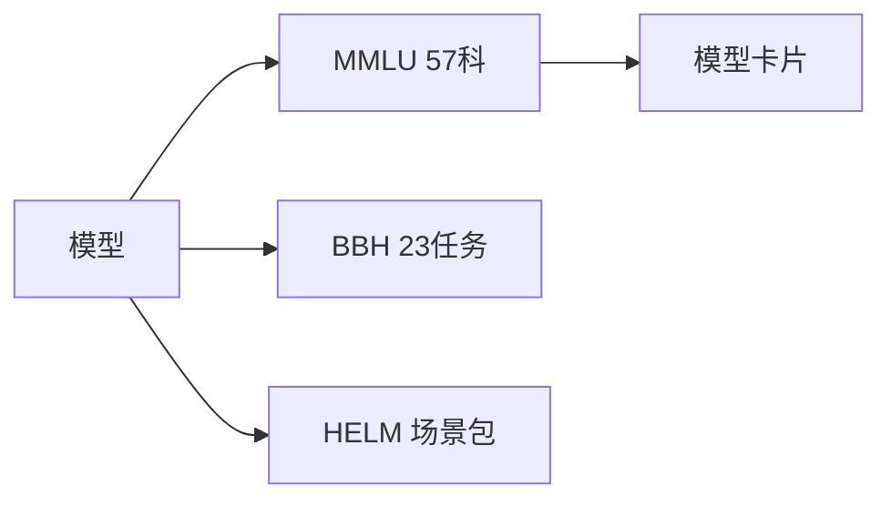

# 7.1.1 综合基准（MMLU、MMLU-Pro、BIG-Bench、HELM）

## 要解决的问题

模型厂商宣称「最强」，需 **覆盖面广、可复现** 的横评。综合基准测评多领域知识、指令遵循与常识推理，是论文与模型卡片的第一指标，但也最易遭遇 **数据污染** 与提示词过拟合（见 [7.2.4](../02-evaluation-methods/04-reliability-contamination)）。

## 核心概念

| 基准 | 规模 | 形式 | 指标 |
| --- | --- | --- | --- |
| **MMLU** | 57 科、~14k MCQ | 4 选一 | Acc |
| **MMLU-Pro** | 更难、10 选项 | 抗猜测 | Acc |
| **BIG-Bench** | 200+ 任务 | 多样 | 归一化分 |
| **BIG-Bench Hard (BBH)** | 23 难任务 | CoT 友好 | Acc |
| **HELM** | 场景框架 | 多指标 | 准、鲁棒、公平等 |

**MCQ 准确率**：

$$
\text{Acc} = \frac{1}{N}\sum_{i=1}^N \mathbb{1}[\arg\max_j p_\theta(y_{i,j}\mid x_i) = y_i^\*]
$$

零样本常用 **5-shot** 或 **CoT + extract** 两种设置，**不可混报**。

## 方法 / 评测规范

1. **提示**：统一 `Answer: (A)` 模板；CoT 需固定 `Let's think step by step`。
2. **提取**：正则取选项字母；失败样本记错（parser 敏感性）。
3. **框架**：`lm-eval-harness`、`opencompass` 锁定版本与 `temperature=0`。
4. **子集**：MMLU-Pro、MMLU-redux 减少标签噪声。

## 工程实践

- 报告 **模型名、revision、shots、prompt hash、harness commit**。
- 与 [5.3 量化](../../05-inference-deployment/03-quantization/01-quantization-basics) 联测：INT4 掉点单独一行。
- 中文综合见 [7.1.3](./03-multilingual-chinese-benchmarks)。

## 代表工作

- Hendrycks et al., MMLU；Wang et al., MMLU-Pro
- Srivastava et al., BIG-Bench；Liang et al., HELM
- Gao et al., `lm-evaluation-harness`

## 实践检查清单

- [ ] 固定评测/推理配置（温度、max_tokens、parser 版本）便于回归
- [ ] 记录硬件：GPU 型号、驱动、框架 commit
- [ ] 对比基线：未优化前 TTFT/TPOT 或 Acc
- [ ] 文档化失败案例：OOM、解析失败率、拒答率
- [ ] 交叉阅读本章「相关章节」避免孤立优化

## 局限与注意点

- MMLU **训练集泄漏** 普遍，高分需配合 held-out 或 Pro/redux。
- BBH CoT 长度影响 [5.1.3 max_tokens](../../05-inference-deployment/01-inference-basics/03-repetition-length-control)。
- HELM 全跑成本高，常采子场景。

## 术语对照（中英）

本节英文关键词：**MMLU、MMLU-Pro、BIG-Bench、HELM**（与社区论文、API 文档检索一致）。

## 延伸阅读

- 本仓库 [LLMs 入口](/llms/intro) 可回溯全局大纲；修改单点优化前建议先读上下游章节链接。
- 技术报告精读见 `llms/08-technical-reports/` 与 [paper-reading](/paper-reading/) 专栏。
- 工程复现优先锁定：框架版本 + 量化格式 + 评测 harness commit，三者缺一即难以对齐论文数字。

## 相关章节

- 同章：[7.1.2 推理](./02-reasoning-benchmarks) · [7.1.3 中文](./03-multilingual-chinese-benchmarks)
- 方法：[7.2.1 自动评估](../02-evaluation-methods/01-reference-based) · [7.2.4 污染](../02-evaluation-methods/04-reliability-contamination)
- 推理模型：[6.2.2 R1](../../06-reasoning-test-time-compute/02-test-time-compute/02-deepseek-r1)
