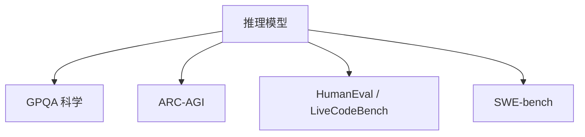

# 7.1.2 推理基准（GPQA、ARC-AGI、HumanEval、SWE-bench）

## 要解决的问题

综合榜（[7.1.1 MMLU](./01-general-benchmarks)）无法区分 **深度推理**。推理基准覆盖专家科学问答、抽象模式、代码与软件工程，是 o1/R1 类模型的主战场，需与数学专榜（[6.1.1](../../06-reasoning-test-time-compute/01-complex-reasoning/01-mathematical-reasoning)）对照阅读。

## 核心概念

| 基准 | 领域 | 指标 | 备注 |
| --- | --- | --- | --- |
| **GPQA** | 研究生级科学 MCQ | Acc | 专家难度，钻石子集 |
| **ARC-AGI** | 抽象网格推理 | 任务 Acc | 抗记忆，极低饱和 |
| **HumanEval** | Python 函数 | pass@k | 经典代码 |
| **MBPP** | 入门编程 | pass@1 | 补充 HumanEval |
| **SWE-bench** | 修真实 GitHub issue | resolve % | Docker 环境 |
| **LiveCodeBench** | 持续新题 | pass@1 | 抗污染 |

**pass@k**（HumanEval）：

$$
\text{pass@k} = \mathbb{E}\left[1-\frac{\binom{n-c}{k}}{\binom{n}{k}}\right]
$$

**GPQA**：常报 **Diamond** 子集 Acc；需 CoT + 强 extractor。

## 方法 / 评测要点

1. **GPQA**：闭卷；禁止检索；多选题选项打乱。
2. **ARC-AGI**：少样本示例在 prompt；测试泛化非记忆。
3. **HumanEval**：`temperature=0.2, n=200` 等论文设置需写明。
4. **SWE-bench Verified**：子集环境稳定，优先报 Verified。
5. **推理预算**：o1/R1 需足够 `max_tokens` 与 `reasoning_effort`（[6.2.1](../../06-reasoning-test-time-compute/02-test-time-compute/01-o1-o3-paradigm)）。

## 工程实践

- 代码评测 **必须沙箱**；SWE 需 GPU+磁盘配额。
- 与 [5.1.2 采样](../../05-inference-deployment/01-inference-basics/02-sampling-strategies) 对齐：代码低温、推理可高温。
- 开源榜：LiveCodeBench、BigCodeBench  leaderboard 持续更新。

## 代表工作

- Rein et al., GPQA；Chollet, ARC
- Chen et al., HumanEval；Jimenez et al., SWE-bench
- DeepSeek-R1、OpenAI o3 系统卡分数

## 实践检查清单

- [ ] 固定评测/推理配置（温度、max_tokens、parser 版本）便于回归
- [ ] 记录硬件：GPU 型号、驱动、框架 commit
- [ ] 对比基线：未优化前 TTFT/TPOT 或 Acc
- [ ] 文档化失败案例：OOM、解析失败率、拒答率
- [ ] 交叉阅读本章「相关章节」避免孤立优化

## 局限与注意点

- HumanEval **饱和**，需 LiveCodeBench + SWE。
- ARC-AGI 样本少，方差大。
- SWE 环境版本漂移导致复现难（[7.2.4](../02-evaluation-methods/04-reliability-contamination)）。

## 延伸阅读

- 本仓库 [LLMs 入口](/llms/intro) 可回溯全局大纲；修改单点优化前建议先读上下游章节链接。
- 技术报告精读见 `llms/08-technical-reports/` 与 [paper-reading](/paper-reading/) 专栏。
- 工程复现优先锁定：框架版本 + 量化格式 + 评测 harness commit，三者缺一即难以对齐论文数字。

## 相关章节

- 同章：[7.1.1 综合](./01-general-benchmarks) · [7.1.5 Agent](./05-agent-benchmarks)
- 专题：[6.1.2 代码](../../06-reasoning-test-time-compute/01-complex-reasoning/02-code-reasoning)
- R1 领读：[paper-reading DeepSeek-R1](/paper-reading/tech-report/deepseek/deepseek-r1)
