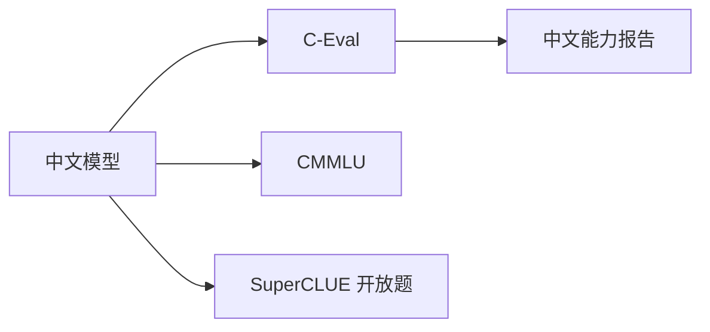

# 多语言与中文基准（C-Eval、CMMLU、SuperCLUE）

## 要解决的问题

MMLU 以英文为主，**中文与多语能力** 需独立基准。国内落地关注 C-Eval、CMMLU 与产业向 SuperCLUE；多语扩展含 MMMLU、INCLUDE 等。评测须匹配 **中文 CoT、字词切分与文化知识**，不可直接翻译英文 prompt 了事。

## 核心概念

| 基准 | 语言 | 覆盖 | 指标 |
| --- | --- | --- | --- |
| **C-Eval** | 中文 | 52 科考试题 | Acc |
| **CMMLU** | 中文 | 67 科本土化 | Acc |
| **SuperCLUE** | 中文 | 多轮开放+客观 | 综合榜 |
| **GAOKAO-Bench** | 中文 | 高考题 | Acc |
| **MMMLU** | 多语 | MMLU 翻译 | Acc |
| **INCLUDE** | 低资源多语 | 区域知识 | Acc |

**评测设置**：

- 0-shot / 5-shot 与 [7.1.1](./01-general-benchmarks) 同样需固定。
- 中文 CoT：`请逐步思考` 等模板影响分数。

## 方法 / 实践

1. **OpenCompass**：统一跑 C-Eval + CMMLU + MMLU 对比中英差距。
2. **Tokenizer**：中文 BPE 效率影响成本，非直接准确率，但长上下文需留意（[3.2 分词](../../03-pre-training/02-tokenization/06-multilingual-tokenization)）。
3. **SuperCLUE**：客观题 + 人工/模型评开放题；商业榜需读评测规则版本。
4. **多语**：MMMLU 检查翻译质量；低资源语用 INCLUDE。

## 工程实践

- 国内合规：评测数据勿含敏感内容；API 路由大陆节点。
- 与 [7.2.3 人类评估](../02-evaluation-methods/03-human-evaluation) 结合看 SuperCLUE 开放域。
- 量化模型中文掉点可能大于英文（[5.3.3 AWQ](../../05-inference-deployment/03-quantization/03-gptq-awq-smoothquant)）。

## 代表工作

- Huang et al., C-Eval；Li et al., CMMLU
- SuperCLUE 官网方法论；Qwen、GLM 技术报告中文分数

## 分数解读示例（示意，非官方）

| 模型档 | C-Eval | CMMLU | 说明 |
| --- | --- | --- | --- |
| 7B 基线 | ~60 | ~55 | 5-shot，随版本变化 |
| 72B+ | ~90 | ~85 | 需核对 harness |
| 推理增强 | +5~15 | 同上 | 长 CoT 需中文模板 |

报告时注明 **OpenCompass 版本** 与是否 **Chain-of-Thought**；与英文 MMLU 分差 >10 点时检查翻译题比例。

## 实践检查清单

- [ ] 固定评测/推理配置（温度、max_tokens、parser 版本）便于回归
- [ ] 记录硬件：GPU 型号、驱动、框架 commit
- [ ] 对比基线：未优化前 TTFT/TPOT 或 Acc
- [ ] 文档化失败案例：OOM、解析失败率、拒答率
- [ ] 交叉阅读本章「相关章节」避免孤立优化

## 局限与注意点

- 考试题 **记忆** 风险同 MMLU（[7.2.4](../02-evaluation-methods/04-reliability-contamination)）。
- 开放榜 **主观性强**，不同评委模型不可比。
- 个人理解：业务应以 **领域私有测试集** 为主，公开榜为辅。

## 延伸阅读

- 本仓库 [LLMs 入口](/llms/intro) 可回溯全局大纲；修改单点优化前建议先读上下游章节链接。
- 技术报告精读见 `llms/08-technical-reports/` 与 [paper-reading](/paper-reading/) 专栏。
- 工程复现优先锁定：框架版本 + 量化格式 + 评测 harness commit，三者缺一即难以对齐论文数字。

## 相关章节

- 同章：[7.1.1 综合](./01-general-benchmarks) · [7.1.2 推理](./02-reasoning-benchmarks)
- 分词：[3.2.6 多语分词](../../03-pre-training/02-tokenization/06-multilingual-tokenization)
- 技术报告：[8.2 Qwen](../../08-technical-reports/02-qwen/01-qwen2-5)
