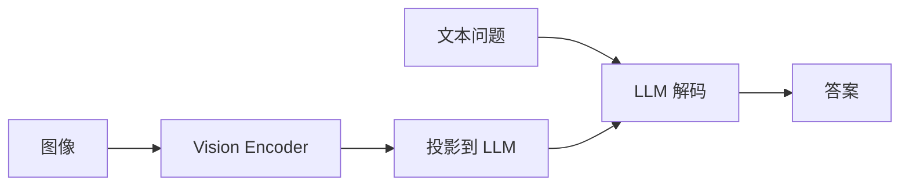

# 多模态基准（MMMU、MathVista）

## 要解决的问题

文本 LLM 评测无法衡量 **看图推理、图表理解、跨模态数学**。多模态大模型（MLLM）需联合视觉编码器与语言解码器，在 MMMU、MathVista、MMBench 等上报告分数。本大纲以文本为主，本节提供与 Agent、推理交叉的评测入口。

## 核心概念

| 基准 | 模态 | 任务 | 指标 |
| --- | --- | --- | --- |
| **MMMU** | 图+文 | 大学级多学科 | Acc |
| **MathVista** | 图+文 | 数学视觉 | Acc |
| **MMBench** | 图 | 感知+推理 | Acc |
| **MM-Vet** | 图 | 综合能力 | GPT-4 评分 |
| **ChartQA** | 图表 | 问答 | Relaxed Acc |
| **DocVQA** | 文档图 | OCR+理解 | ANLS |

**MLLM 推理链**：

$$
p(\text{answer} \mid \text{image}, \text{text}) = \sum_{\text{CoT}} p(\text{answer}\mid \text{CoT}, I, T)\,p(\text{CoT}\mid I,T)
$$

实践中常 **单条 CoT**，与 [6.1.1 数学](../../06-reasoning-test-time-compute/01-complex-reasoning/01-mathematical-reasoning) 结合。

## 方法 / 评测注意

1. **分辨率**：输入像素与 patch 数影响细节题（Chart、Doc）。
2. **提示**：是否允许 **工具 OCR** 须在报告中声明。
3. **Judge**：[7.2.2 LLM-as-Judge](../02-evaluation-methods/02-llm-as-judge) 在 MM-Vet 常见。
4. **推理模型**：o1/R1 纯文本版不跑多模态；需 Gemini/Qwen-VL 等。

## 工程实践

- 推理成本：视觉 token 计入 Prefill（[5.1.4 TTFT](../../05-inference-deployment/01-inference-basics/04-latency-metrics)）。
- 框架：`lmms-eval`、`VLMEvalKit`。
- 与 [7.1.2](./02-reasoning-benchmarks) 文本推理榜分开报。

## 代表工作

- Yue et al., MMMU；Lu et al., MathVista
- Liu et al., MMBench；Yu et al., MM-Vet

## 实践检查清单

- [ ] 固定评测/推理配置（温度、max_tokens、parser 版本）便于回归
- [ ] 记录硬件：GPU 型号、驱动、框架 commit
- [ ] 对比基线：未优化前 TTFT/TPOT 或 Acc
- [ ] 文档化失败案例：OOM、解析失败率、拒答率
- [ ] 交叉阅读本章「相关章节」避免孤立优化

## 局限与注意点

- 视觉题 **泄漏**（网络原图）难检测。
- Judge 模型偏见导致分数虚高（[7.2.2](../02-evaluation-methods/02-llm-as-judge)）。
- 待验证：文本 LLM + 外接 OCR 与端到端 MLLM 分数不可直接比。

## 术语对照（中英）

本节英文关键词：**MMMU、MathVista**（与社区论文、API 文档检索一致）。

## 延伸阅读

- 本仓库 [LLMs 入口](/llms/intro) 可回溯全局大纲；修改单点优化前建议先读上下游章节链接。
- 技术报告精读见 `llms/08-technical-reports/` 与 [paper-reading](/paper-reading/) 专栏。
- 工程复现优先锁定：框架版本 + 量化格式 + 评测 harness commit，三者缺一即难以对齐论文数字。

## 相关章节

- 同章：[7.1.1](./01-general-benchmarks) · [7.1.5 Agent](./05-agent-benchmarks)
- 评估方法：[7.2.2 Judge](../02-evaluation-methods/02-llm-as-judge)
- 技术报告：[8.2 Qwen3](../../08-technical-reports/02-qwen/02-qwen3)（多模态）
