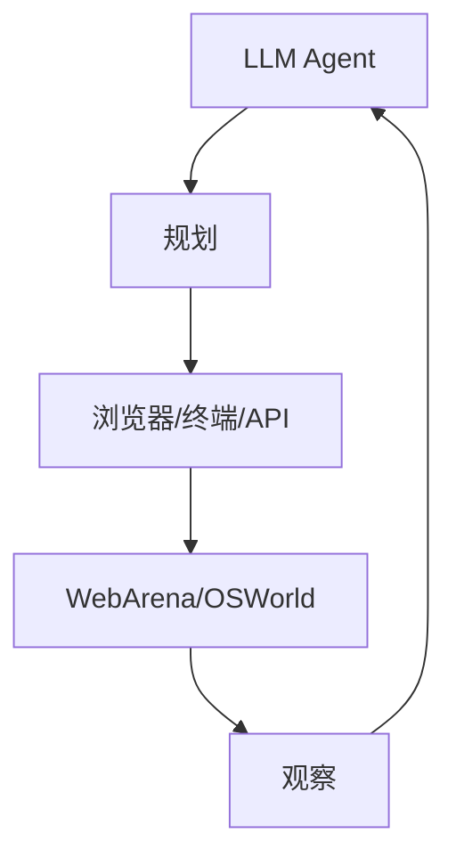

# 7.1.5 Agent 基准（WebArena、OSWorld）

## 要解决的问题

工具调用、浏览器操作、桌面 GUI 等 **多步 Agent** 能力无法用 MMLU 衡量。Agent 基准提供可执行环境、成功条件与步数上限，衡量完成真实任务的比例，与 [6.1.4 多步瓶颈](../../06-reasoning-test-time-compute/01-complex-reasoning/04-multi-step-bottleneck)、`docs/` Agent 章节直接相关。

## 核心概念

| 基准 | 环境 | 任务例 | 指标 |
| --- | --- | --- | --- |
| **WebArena** | 自托管网站 | 电商、论坛操作 | success rate |
| **VisualWebArena** | 渲染网页+截图 | 需视觉 | success rate |
| **OSWorld** | Ubuntu 桌面 | 打开应用、改设置 | success rate |
| **SWE-bench** | 代码仓库 | 修 issue | resolve（亦属 [7.1.2](./02-reasoning-benchmarks)） |
| **τ-bench / AgentBench** | 多域工具 | API、DB、游戏 | 任务完成率 |
| **GAIA** | 多步+工具 | 难问答 | Acc |

**成功判定**：

$$
\text{Success} = \mathbb{1}[\text{env.final\_state} \models \text{goal}]
$$

常含 **步数限制** $T_{\max}$、**费用限制** $。

## 方法 / 评测协议

1. **可复现**：Docker 镜像固定版本；随机种子控制站点状态。
2. **基线**：纯 ReAct、带反思、带 [6.2.3 PRM](../../06-reasoning-test-time-compute/02-test-time-compute/03-prm-vs-orm) 筛选动作。
3. **模型**：需 Function Call / 结构化输出（`docs/01-llm-intro/`）。
4. **成本**：报告平均步数、token、API 调用次数。

## 工程实践

- 并行沙箱隔离；防 Agent 删库（权限最小化）。
- 与 [5.6.3 调度](../../05-inference-deployment/06-inference-serving/03-scheduling-load-balancing) 无关，但长任务需高 `max_tokens`。
- 人类演示轨迹可作 SFT 数据（[4.1 SFT](../../04-post-training-alignment/01-sft/02-data-construction)）。

## 代表工作

- Zhou et al., WebArena；Xie et al., OSWorld
- Yoran et al., τ-bench；Mialon et al., GAIA

## 实践检查清单

- [ ] 固定评测/推理配置（温度、max_tokens、parser 版本）便于回归
- [ ] 记录硬件：GPU 型号、驱动、框架 commit
- [ ] 对比基线：未优化前 TTFT/TPOT 或 Acc
- [ ] 文档化失败案例：OOM、解析失败率、拒答率
- [ ] 交叉阅读本章「相关章节」避免孤立优化

## 局限与注意点

- 环境 **脆弱**：前端改版导致 baseline 失效。
- 成功率低（不足 30% 常见），方差大，需多次运行。
- 闭源 API Agent 与开源权重 **不可直接比** 同环境（工具实现差异）。

## 术语对照（中英）

本节英文关键词：**WebArena、OSWorld**（与社区论文、API 文档检索一致）。

## 延伸阅读

- 本仓库 [LLMs 入口](/llms/intro) 可回溯全局大纲；修改单点优化前建议先读上下游章节链接。
- 技术报告精读见 `llms/08-technical-reports/` 与 [paper-reading](/paper-reading/) 专栏。
- 工程复现优先锁定：框架版本 + 量化格式 + 评测 harness commit，三者缺一即难以对齐论文数字。

## 相关章节

- 同章：[7.1.2 推理/代码](./02-reasoning-benchmarks)
- Agent 文档：`docs/00-agent-intro/`
- 人类评：[7.2.3](../02-evaluation-methods/03-human-evaluation) · 污染：[7.2.4](../02-evaluation-methods/04-reliability-contamination)
