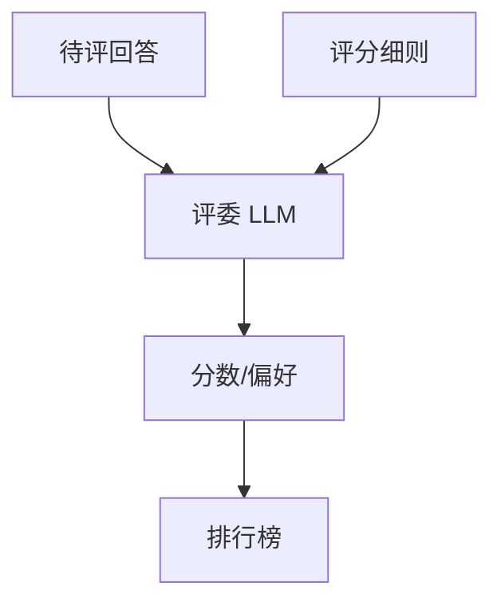

# LLM-as-a-Judge

## 要解决的问题

聊天质量、有用性、安全性、创意写作等 **无唯一参考答案**。人工评昂贵；**LLM-as-a-Judge** 用强模型（GPT-4、Claude、Qwen-Max）按 rubric 打分或 pairwise 比较，实现近线性扩展的自动评估，支撑 AlpacaEval、MT-Bench、Arena 类榜单。

## 核心概念

| 模式 | 做法 | 偏差风险 |
| --- | --- | --- |
| **Pointwise** | 单回答 1–10 分 | 分数校准漂移 |
| **Pairwise** | A vs B 谁更好 | 位置偏见 |
| **Rubric** | 维度：有用/诚实/无害 | 评委模型能力上限 |
| **Reference-aided** | 给金标再评 | 降低幻觉评判 |

**Pairwise 位置偏见缓解**：交换 A/B 顺序两次投票：

$$
\text{win}(A) = \mathbb{1}[\text{Judge}(A,B)=\!A] + \mathbb{1}[\text{Judge}(B,A)=\!A]
$$

（需定义平局规则。）

## 方法 / 最佳实践

1. **评委**：固定版本；勿用被测模型自身作 judge（自嗨）。
2. **提示**：少样本示例 + 链式评判（先分析再分数）。
3. **校准**：与 [7.2.3 人类](./03-human-evaluation) 对齐 200+ 条估 Spearman。
4. **成本**：缓存 prompt；批处理；小模型预筛 + 大模型复审。

## 工程实践

- **AlpacaEval 2.0**、**MT-Bench**：开源 prompt 与 judge 配置。
- 多模态用 GPT-4V judge（[7.1.4](../01-benchmarks/04-multimodal-benchmarks)）。
- 与 RLHF RM 区别：Judge 用于 **评测**；RM 用于 **训练**（[4.3.2](../../04-post-training-alignment/03-rlhf/02-reward-model)）。

## 代表工作

- Zheng et al., *Judging LLM-as-a-Judge with MT-Bench and Chatbot Arena*
- Dubois et al., AlpacaEval；Kim et al., Prometheus 评委模型

## 实践检查清单

- [ ] 固定评测/推理配置（温度、max_tokens、parser 版本）便于回归
- [ ] 记录硬件：GPU 型号、驱动、框架 commit
- [ ] 对比基线：未优化前 TTFT/TPOT 或 Acc
- [ ] 文档化失败案例：OOM、解析失败率、拒答率
- [ ] 交叉阅读本章「相关章节」避免孤立优化

## 局限与注意点

- **自我增强**：闭源强模型评委有利于同源模型（偏见文献已证实）。
- 长度偏见：长回答常被判更好（[5.1.3 长度](../../05-inference-deployment/01-inference-basics/03-repetition-length-control)）。
- 敏感内容 judge 拒评 → 样本缺失需报告 rate。

## 术语速记

正文英文术语与开源实现（GitHub、Hugging Face）命名一致，便于检索源码与 Issue。

## 延伸阅读

- 本仓库 [LLMs 入口](/llms/intro) 可回溯全局大纲；修改单点优化前建议先读上下游章节链接。
- 技术报告精读见 `llms/08-technical-reports/` 与 [paper-reading](/paper-reading/) 专栏。
- 工程复现优先锁定：框架版本 + 量化格式 + 评测 harness commit，三者缺一即难以对齐论文数字。

## 相关章节

- 同章：[7.2.1 参考评估](./01-reference-based) · [7.2.3 人类](./03-human-evaluation)
- 对齐：[4.3 RLHF](../../04-post-training-alignment/03-rlhf/01-rlhf-pipeline)
- 中文榜：[7.1.3 SuperCLUE](../01-benchmarks/03-multilingual-chinese-benchmarks)
