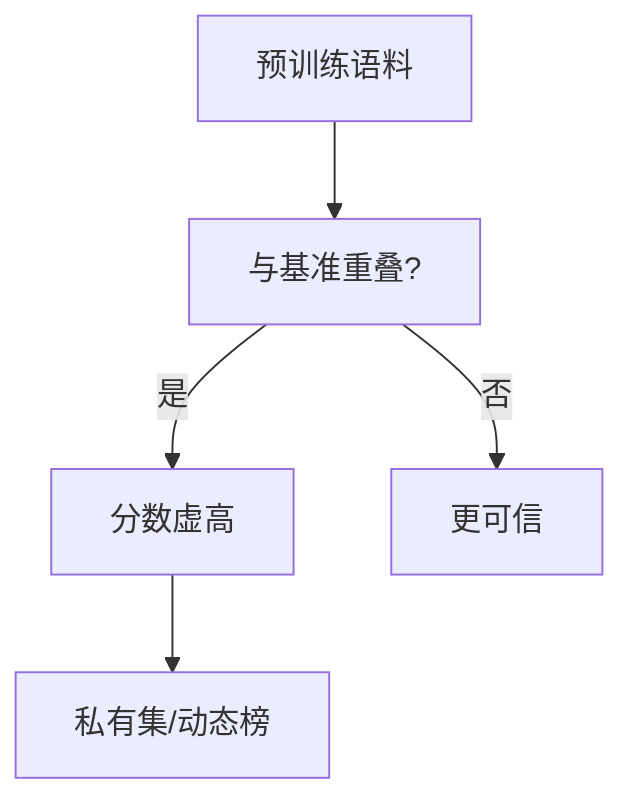

# 评估的可靠性、污染与作弊问题

## 要解决的问题

基准分数已是营销核心资产，**训练数据污染**（评测题进预训练）、**提示词过拟合**、**测试集泄漏** 与 **人为刷榜** 使公开分数失真。构建可靠评估需理解污染检测、held-out 基准、可复现协议与诚信规范。

## 核心概念

| 问题 | 机制 | 检测/缓解 |
| --- | --- | --- |
| **数据污染** | 评测 QA 出现在预训练语料 | n-gram 重叠、Membership Inference |
| **过拟合提示** | 在 dev 上调 prompt | 独立 test、Prompt 固定 hash |
| **基准饱和** | HumanEval 等满分 | LiveCodeBench、私有集 |
| **评测黑客** | 特殊 token、格式作弊 | 规则过滤、人工审计 |
| **不可复现** | 未公开温度/版本 | Model card + harness commit |

**污染启发式**（示意）：

$$
\text{Contam}(x) = \mathbb{1}[\exists \text{ n-gram}_k(x) \in \text{TrainCorpus}]
$$

高重叠不必然泄漏，但触发 **人工复核**（Oren et al.）。

## 方法 / 可靠评测清单

1. **固定协议**：模型 revision、shots、温度、parser 脚本（[7.2.1](./01-reference-based)）。
2. **动态基准**：LiveCodeBench、LiveBench 定期换新题。
3. **私有 holdout**：企业内部 **永不公开** 的测试集作发布门禁。
4. **多证据**：MMLU + 人类 Arena + 领域集 **三角验证**。
5. **推理模型**：报告 thinking token 与 `reasoning_effort`（[6.2.1](../../06-reasoning-test-time-compute/02-test-time-compute/01-o1-o3-paradigm)）。

## 工程实践

- 训练前：**去污染** pipeline 剔除与 MMLU/HumanEval 高重叠文档（[3.1.2 清洗](../../03-pre-training/01-pretraining-data/02-cleaning-deduplication)）。
- 发布时：附 **训练数据截止日** 与 **评测 harness 版本**。
- 开源权重：社区可跑 `lm-eval` 复现；闭源需第三方审计（稀缺）。

## 代表工作

- Brown et al., 讨论 GPT-3 与基准重叠；Sainz et al., 污染检测工具
- Deng et al., *Investigating Data Contamination in Modern Benchmarks*
- OpenAI 系统卡、DeepSeek 技术报告中的评测声明

## 实践检查清单

- [ ] 固定评测/推理配置（温度、max_tokens、parser 版本）便于回归
- [ ] 记录硬件：GPU 型号、驱动、框架 commit
- [ ] 对比基线：未优化前 TTFT/TPOT 或 Acc
- [ ] 文档化失败案例：OOM、解析失败率、拒答率
- [ ] 交叉阅读本章「相关章节」避免孤立优化

## 局限与注意点

- 无法证明 **零污染**，只能降低风险。
- 私有集不可比，但更可反映业务（个人理解：合规场景优先私有集）。
- 「待验证」：部分厂商 few-shot 示例本身含答案模式，属协议问题非污染。

## 术语速记

正文英文术语与开源实现（GitHub、Hugging Face）命名一致，便于检索源码与 Issue。

## 延伸阅读

- 本仓库 [LLMs 入口](/llms/intro) 可回溯全局大纲；修改单点优化前建议先读上下游章节链接。
- 技术报告精读见 `llms/08-technical-reports/` 与 [paper-reading](/paper-reading/) 专栏。
- 工程复现优先锁定：框架版本 + 量化格式 + 评测 harness commit，三者缺一即难以对齐论文数字。

## 相关章节

- 同章：[7.2.1](./01-reference-based) · [7.2.2](./02-llm-as-judge) · [7.2.3](./03-human-evaluation)
- 基准：[7.1.1 MMLU](../01-benchmarks/01-general-benchmarks) · [7.1.2 HumanEval](../01-benchmarks/02-reasoning-benchmarks)
- 数据：[3.1 预训练数据](../../03-pre-training/01-pretraining-data/01-data-sources)
