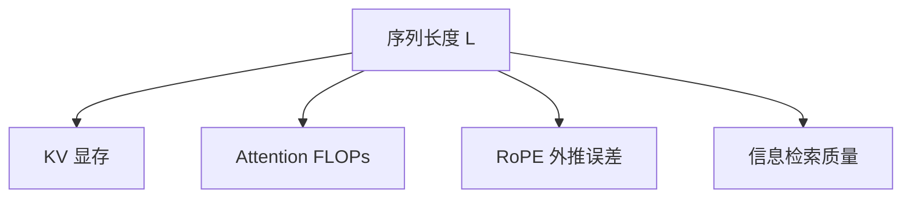

# 长上下文的挑战

## 要解决的问题

Agent、代码库 RAG、法律与日志分析等场景需要 **数十万 token** 输入，但标准 Transformer 在 **训练长度、位置外推、KV 显存、注意力噪声** 四方面同时承压。

## 复杂度与显存

| 瓶颈 | 量级 | 说明 |
| --- | --- | --- |
| 训练 attention | $O(L^2)$ FLOPs | 长度翻倍，算力约 **4×** |
| 推理 KV | $\approx 2 L H d_\text{head} \times \text{layers}$ | 线性随 $L$ 增长，多用户批处理放大 |
| 预填充延迟 | 与 $L$ 相关 | 首 token 前需处理全长 prompt |

MLA、GQA、量化 KV 等见 [5.2 KV Cache](../../05-inference-deployment/02-kv-cache-attention-optimization/)。

## 四大挑战

### 1. 训练-推理长度不一致

模型常在 **4K–32K** 预训练，部署却要求 **128K+** → 需 [位置插值 / YaRN](./02-context-extension) 或 **继续训练** 长文。

### 2. 有效注意力预算

即使窗口合法，**中间遗忘**（lost in the middle）使远距离关键信息未被 attend。

### 3. 评测与真实任务错位

刷榜 **Needle** 不等于长文档 **推理、综合、跨段引用** 能力。

### 4. 系统栈未就绪

长 prefill 导致 **TTFT** 飙升；PagedAttention 缓解碎片但非根解。

## 工业应对谱系

| 路线 | 代表 |
| --- | --- |
| 压缩 KV | MLA、MQA/GQA |
| 稀疏/线性 attention | DSA、Lightning、Mamba |
| 上下文扩展算法 | YaRN、LongRoPE |
| 外部记忆 | RAG、摘要、记忆模块（见 [9.2](../02-memory-continual-learning/)） |

## 工程指标

- **TTFT**、**tokens/s**、**$/1M context token**
- **Needle pass rate** vs **真实任务成功率**
- 满载 128K 时 **GPU 显存峰值**

## 局限与注意点

- 「支持 1M 窗口」≠ **有效理解 1M**（见 [9.1.4](./04-million-token-context)）。
- 单纯拉长窗口 **不替代** 检索与工具（Agent 仍要 RAG）。
- 长文 **污染评测** 更难检测（见第七部分）。

## 检查清单（自学 / 落地）

| 步骤 | 动作 |
| --- | --- |
| 1 | 阅读官方 primary source（报告、博客、模型卡） |
| 2 | 固定 prompt 与解码参数，在自有验证集上建基线 |
| 3 | 记录延迟、成本、上下文长度与是否启用思考模式 |
| 4 | 与相邻章节对照，画出与上下游模块的数据流 |
| 5 | 在 [paper-reading](/paper-reading/) 或本大纲相关节做深度笔记 |

## 常见误区

| 误区 | 澄清 |
| --- | --- |
| 公开基准 = 产品表现 | 必须用业务端到端任务回归 |
| 长窗口 = 长理解 | 需 Needle + 真实文档任务验证 |
| 单次实验可定论 | 固定随机种子、数据版本与评测脚本 |

## 延伸练习

- 复现表中 **一行关键结论**（ablation 或小型对照实验）。
- 用 [附录 D 工具](../../10-appendix/04-d-tools-ecosystem) 或 [lm-eval](https://github.com/EleutherAI/lm-evaluation-harness) 跑通评测脚本。
- 将未知参数整理进 [9.5.3 开放问题](../05-conclusion/03-open-questions) 个人笔记。

## 相关章节

- 扩展方法：[9.1.2 上下文扩展](./02-context-extension)
- Needle 评测：[9.1.3](./03-needle-in-haystack)
- 稀疏注意力：[2.3.6](../../02-transformer/03-transformer-improvements/06-sparse-attention/)
