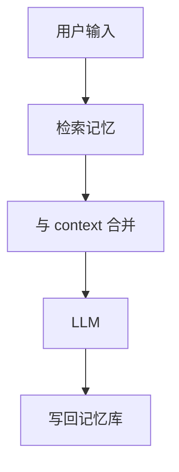

# LLM 的长期记忆机制

## 要解决的问题

Transformer 权重 **静态**，对话上下文 **有限**；Agent 需要跨会话记住用户偏好、项目状态与工具结果。仅靠扩大窗口 **成本高且不可扩展**，需显式 **记忆层**。

## 记忆分层（常见架构）

| 层级 | 存储 | 寿命 | 示例 |
| --- | --- | --- | --- |
| **工作记忆** | 当前 context | 单轮/多轮 | 聊天历史 |
| **情景记忆** | 向量库 + 元数据 | 会话/项目 | Mem0、Zep |
| **语义记忆** | 知识图谱/文档 | 长期 | 企业 Wiki 索引 |
| **程序记忆** | 权重/LoRA | 永久 | SFT 后技能 |

## 实现模式

### 1. RAG 式外挂

检索相关片段 **注入 prompt**；见 `docs` RAG 章节。优点：可解释、可删改；缺点：检索失败即失忆。

### 2. 记忆压缩

周期性用 LLM **摘要** 历史 → 写入记忆槽；参考 Generative Agents「反思」机制。

### 3. 结构化记忆

键值：**用户_id → 偏好**；工具：**任务_id → 状态机**。

### 4. 参数化记忆

通过 **持续微调/LoRA** 写入权重（见 [9.2.3](./03-continual-learning)）；难精确删除。

## 与长上下文关系

| 策略 | 适用 |
| --- | --- |
| 128K 窗内搞定 | 单次代码审查 |
| 记忆 + 短窗 | 终身助手、客服 |
| 长窗 + 记忆 | 冗余但鲁棒（成本高） |

## 工程实践

- **写入策略**：何时记？（显式命令 vs 自动提取）防 **污染记忆**。
- **过期与 GDPR**：支持用户删除向量条目。
- **评测**：LongMemEval、多轮一致性基准。

## 局限与注意点

- 检索 **歧义** 导致错误记忆调用，幻觉叠加。
- 多 Agent **共享记忆** 需并发控制。
- 「类人记忆」认知机制 **未** 在 LLM 中复现（见 [9.4.1](../04-toward-agi/01-capability-boundaries)）。

## 检查清单（自学 / 落地）

| 步骤 | 动作 |
| --- | --- |
| 1 | 阅读官方 primary source（报告、博客、模型卡） |
| 2 | 固定 prompt 与解码参数，在自有验证集上建基线 |
| 3 | 记录延迟、成本、上下文长度与是否启用思考模式 |
| 4 | 与相邻章节对照，画出与上下游模块的数据流 |
| 5 | 在 [paper-reading](/paper-reading/) 或本大纲相关节做深度笔记 |

## 常见误区

| 误区 | 澄清 |
| --- | --- |
| 公开基准 = 产品表现 | 必须用业务端到端任务回归 |
| 长窗口 = 长理解 | 需 Needle + 真实文档任务验证 |
| 单次实验可定论 | 固定随机种子、数据版本与评测脚本 |

## 延伸练习

- 复现表中 **一行关键结论**（ablation 或小型对照实验）。
- 用 [附录 D 工具](../../10-appendix/04-d-tools-ecosystem) 或 [lm-eval](https://github.com/EleutherAI/lm-evaluation-harness) 跑通评测脚本。
- 将未知参数整理进 [9.5.3 开放问题](../05-conclusion/03-open-questions) 个人笔记。

## 相关章节

- 模型编辑：[9.2.2](./02-model-editing)
- 持续学习：[9.2.3](./03-continual-learning)
- Prefix 缓存：[5.2.4](../../05-inference-deployment/02-kv-cache-attention-optimization/04-prefix-prompt-caching)
