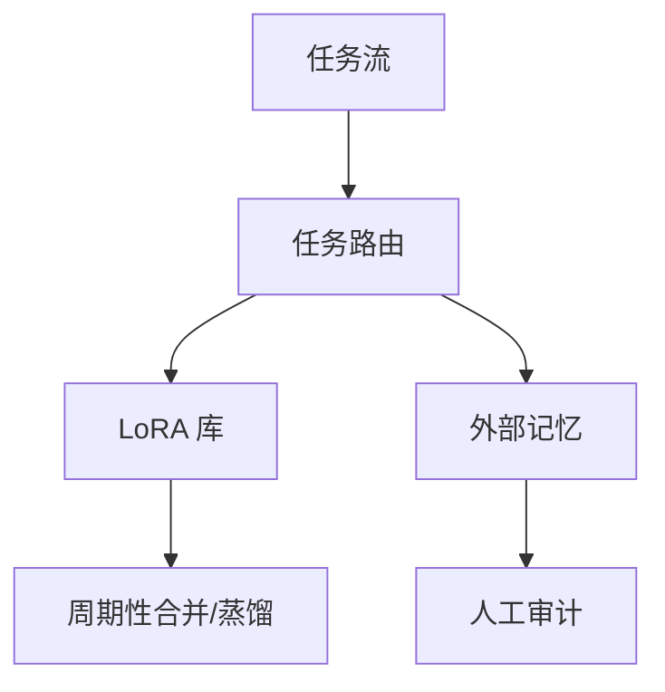

# 终身学习的挑战

## 要解决的问题

**终身学习（Lifelong Learning）** 要求系统像人类一样 **一生积累技能** 而不崩溃。LLM + Agent 是否接近该目标，还是仅 **序列微调 + 外挂记忆** 的近似？

## 与持续学习的区别

| | 持续学习（CL） | 终身学习 |
| --- | --- | --- |
| 时间尺度 | 版本迭代、月级 | 年级、开放任务流 |
| 任务边界 | 常已知 | 开放、非平稳 |
| 目标 | 控制遗忘 | 累积 + 迁移 + 自我改进 |

## 开放挑战

### 1. 无界任务空间

新工具、新 API、新语言不断出现；**固定参数** 容量有上限。

### 2. 记忆-参数分工

何时写入 **向量记忆**，何时 **更新权重**？缺乏统一理论。

### 3. 自我改进闭环

模型生成训练数据 → 再训练 → **偏差放大**（见 [9.4.3](../04-toward-agi/03-recursive-self-improvement)）。

### 4. 评价缺失

缺少 **十年尺度** 基准；短期榜无法预测长期退化。

## 可能架构（研究向）

## 工业现实（2025）

- 主流：**定期大版本** + RAG + 少量 LoRA，而非真终身。
- Agent **状态机** 承担「项目级终身」记忆。
- **个人理解**：真终身需 **可验证卸载**（删技能不伤全局），当前编辑/RAG 均不完备（待验证）。

## 伦理与安全

- 终身积累 **用户隐私** 不可无限保留。
- 「学会」有害技能后 **难以擦除** → 对齐与编辑仍必要。

## 局限与注意点

- 学术 CL 基准（Split-MNIST）与 LLM **尺度不匹配**。
- 多 Agent 协作的终身记忆 **无标准**。
- AGI 叙事易 **过度承诺** 终身能力。

## 检查清单（自学 / 落地）

| 步骤 | 动作 |
| --- | --- |
| 1 | 阅读官方 primary source（报告、博客、模型卡） |
| 2 | 固定 prompt 与解码参数，在自有验证集上建基线 |
| 3 | 记录延迟、成本、上下文长度与是否启用思考模式 |
| 4 | 与相邻章节对照，画出与上下游模块的数据流 |
| 5 | 在 [paper-reading](/paper-reading/) 或本大纲相关节做深度笔记 |

## 常见误区

| 误区 | 澄清 |
| --- | --- |
| 公开基准 = 产品表现 | 必须用业务端到端任务回归 |
| 长窗口 = 长理解 | 需 Needle + 真实文档任务验证 |
| 单次实验可定论 | 固定随机种子、数据版本与评测脚本 |

## 延伸练习

- 复现表中 **一行关键结论**（ablation 或小型对照实验）。
- 用 [附录 D 工具](../../10-appendix/04-d-tools-ecosystem) 或 [lm-eval](https://github.com/EleutherAI/lm-evaluation-harness) 跑通评测脚本。
- 将未知参数整理进 [9.5.3 开放问题](../05-conclusion/03-open-questions) 个人笔记。

## 相关章节

- 持续学习：[9.2.3](./03-continual-learning)
- 长期记忆：[9.2.1](./01-long-term-memory)
- 能力边界：[9.4.1](../04-toward-agi/01-capability-boundaries)
