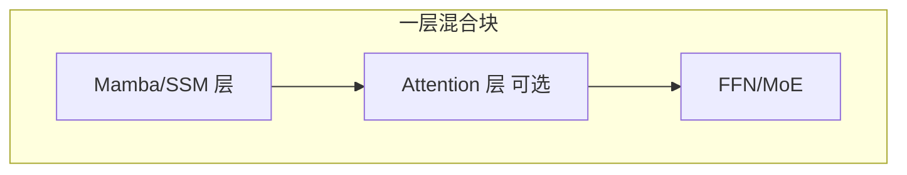

# 混合架构（Jamba、Zamba）

## 要解决的问题

纯 SSM（Mamba）在 **检索/拷贝** 上存疑，纯 Transformer **长序列贵**。**混合层** 交替 Attention 与 SSM/RWKV，试图 **兼得质量与吞吐**。

## 设计模式

| 模式 | 描述 |
| --- | --- |
| **A-S-A-S…** | 每 $k$ 层插一层 full/local attention |
| **SSM 为主 + 稀疏注意力** | 大部分层线性，少数层恢复全局 |
| **MoE + 混合** | 专家 FFN + 异构注意力（研究前沿） |

## 代表模型

| 模型 | 组合 |
| --- | --- |
| **Jamba** | Mamba + Attention + MoE（AI21） |
| **Zamba** | 少量 attention 层 + SSM 主体 |
| **MiniMax** | Lightning + 标准 attention 周期块（见 [8.6.1](../../08-technical-reports/06-others/01-minimax)） |

## 训练与推理

- **训练**：SSM 用并行扫描；Attention 用 FlashAttention。
- **推理**：SSM 段 **常数状态**；Attention 段仍要 KV（但层数少 → 省显存）。
- **调参**：attention 层 **比例** 是核心超参（如 1:7）。

## 选型建议

| 场景 | 倾向 |
| --- | --- |
| 超长流式生成 | 提高 SSM 比例 |
| 代码/Agent 工具 | 保留更多 attention |
| 边缘 | 小混合模型 + 量化 |

## 局限与注意点

- 实现 **复杂度高**（两套 kernel、checkpoint 格式不统一）。
- 论文分数 **≠** vLLM 生产性能，需自建 benchmark。
- 与 **DSA/MLA** 稀疏 Transformer 路线 **竞争**，尚无定论。

## 检查清单（自学 / 落地）

| 步骤 | 动作 |
| --- | --- |
| 1 | 阅读官方 primary source（报告、博客、模型卡） |
| 2 | 固定 prompt 与解码参数，在自有验证集上建基线 |
| 3 | 记录延迟、成本、上下文长度与是否启用思考模式 |
| 4 | 与相邻章节对照，画出与上下游模块的数据流 |
| 5 | 在 [paper-reading](/paper-reading/) 或本大纲相关节做深度笔记 |

## 常见误区

| 误区 | 澄清 |
| --- | --- |
| 公开基准 = 产品表现 | 必须用业务端到端任务回归 |
| 长窗口 = 长理解 | 需 Needle + 真实文档任务验证 |
| 单次实验可定论 | 固定随机种子、数据版本与评测脚本 |

## 延伸练习

- 复现表中 **一行关键结论**（ablation 或小型对照实验）。
- 用 [附录 D 工具](../../10-appendix/04-d-tools-ecosystem) 或 [lm-eval](https://github.com/EleutherAI/lm-evaluation-harness) 跑通评测脚本。
- 将未知参数整理进 [9.5.3 开放问题](../05-conclusion/03-open-questions) 个人笔记。

## 相关章节

- Mamba：[9.3.1](./01-mamba-ssm)
- RWKV：[9.3.2](./02-rwkv-retnet)
- DeepSeek 稀疏：[2.3.6.4](../../02-transformer/03-transformer-improvements/06-sparse-attention/04-deepseek-sparse-route)
