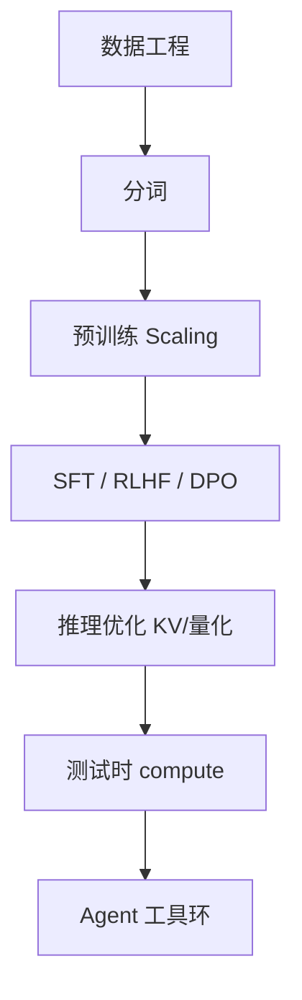

# 9.5.1 LLM 技术的全景回顾

## 本大纲覆盖了什么

《LLMs 学习大纲》从 **基础 → Transformer → 预训练 → 对齐 → 推理部署 → 推理时 compute → 评估 → 技术报告 → 前沿** 串联 2023–2026 主线。本节做 **一页纸地图**，便于复习与跳转。

## 技术栈时间线（压缩）

| 阶段 | 关键词 | 章节 |
| --- | --- | --- |
| 2017–2019 | Transformer、BERT/GPT | [第二部分](../../02-transformer/) |
| 2020–2022 | Scaling、InstructGPT、RLHF | [第三部分](../../03-pre-training/)、[第四部分](../../04-post-training-alignment/) |
| 2023–2024 | ChatGPT、开源 Llama、MoE 复兴 | [第八部分](../../08-technical-reports/) |
| 2025+ | 推理模型 R1/o、Agent、长上下文、DSA | [第六部分](../../06-reasoning-test-time-compute/)、[第九部分](../) |

## 能力从何而来（因果链）

## 五条「杠杆」

1. **参数量与数据量**（Chinchilla、涌现争议）
2. **架构效率**（MoE、MLA、稀疏 attention）
3. **对齐数据质量**（少而精 vs 规模）
4. **推理系统**（vLLM、投机解码、量化）
5. **测试时算力**（CoT、MCTS、PRM）

## 开源 vs 闭源（2025 态势）

- **权重开源**：DeepSeek、Qwen、Llama、Mistral 等逼近闭源旗舰。
- **数据/训练细节**：仍多保密；**OLMo** 走全开放科研路线。
- **产品层**：API 聚合、Agent 平台、合规 **仍壁垒**。

## 仍未解决的核心问题

- 幻觉、可验证推理、持续学习、安全对齐 **无银弹**。
- 评测 **污染** 与 **经济真实任务** 脱节。
- 能耗与 **地缘算力** 约束商业化。

## 如何使用本大纲

- **入门**：1 → 2 → 3.1–3.3 → 4.1 → 5.1。
- **训练工程师**：3 全 + 4.3–4.4 + 3.5–3.6。
- **推理/部署**：5 全 + 8 技术报告选读。
- **Agent 应用**：第六部分 + `docs` + [9.2 记忆](../02-memory-continual-learning/)。

## 检查清单（自学 / 落地）

| 步骤 | 动作 |
| --- | --- |
| 1 | 阅读官方 primary source（报告、博客、模型卡） |
| 2 | 固定 prompt 与解码参数，在自有验证集上建基线 |
| 3 | 记录延迟、成本、上下文长度与是否启用思考模式 |
| 4 | 与相邻章节对照，画出与上下游模块的数据流 |
| 5 | 在 [paper-reading](/paper-reading/) 或本大纲相关节做深度笔记 |

## 常见误区

| 误区 | 澄清 |
| --- | --- |
| 公开基准 = 产品表现 | 必须用业务端到端任务回归 |
| 长窗口 = 长理解 | 需 Needle + 真实文档任务验证 |
| 单次实验可定论 | 固定随机种子、数据版本与评测脚本 |

## 延伸练习

- 复现表中 **一行关键结论**（ablation 或小型对照实验）。
- 用 [附录 D 工具](../../10-appendix/04-d-tools-ecosystem) 或 [lm-eval](https://github.com/EleutherAI/lm-evaluation-harness) 跑通评测脚本。
- 将未知参数整理进 [9.5.3 开放问题](../05-conclusion/03-open-questions) 个人笔记。

## 相关章节

- 从业者建议：[9.5.2](./02-advice-practitioners)
- 开放问题：[9.5.3](./03-open-questions)
- 入口：[LLMs intro](../../00-intro)
