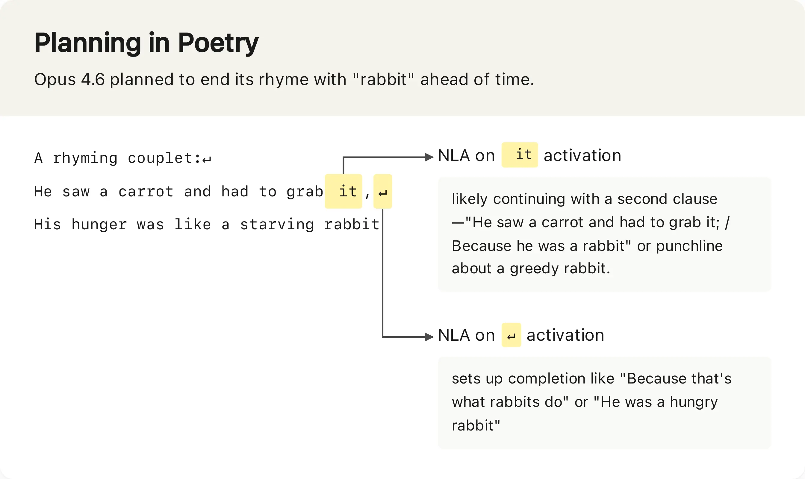

# Claude: Natural Language Autoencoders

> 核心来源：[Natural Language Autoencoders: Turning Claude's thoughts into text](https://www.anthropic.com/research/natural-language-autoencoders)（Anthropic，2026-05-07）

与 Claude 对话时，我们用的是自然语言；模型内部却把词转成一长串数字（**activations / 激活**），再生成输出。这些中间激活就像神经活动一样编码了模型的「想法」，但**极难直接读懂**。

过去几年，稀疏自编码器（SAE）、归因图（attribution graphs）等工具显著推进了激活理解，但它们的输出仍是需要研究者仔细解读的复杂对象——**工具本身不会「用人话说话」**。

Natural Language Autoencoders（**NLA，自然语言自编码器**）试图把这一步推进到可直接阅读：把激活翻译成我们能读的自然语言解释。

> 以下为 NLA 对 Opus 4.6 在输出中部分 Token 的解释：



## 核心思想：用重建质量定义「好解释」

我们无法直接知道某个激活究竟编码了什么，因此不能简单地用人工标注来监督「解释是否准确」。NLA 的判据是**往返一致性**：

1. 把激活 verbalize 成文本解释；
2. 再从这段文本 **reconstruct** 回激活向量；
3. 若重建激活与原始激活足够接近，则认为解释「够好」。

训练上，让模型学会产出**既能读懂、又能支撑准确重建**的解释。

## 架构：三个模型副本

对目标语言模型做三份拷贝：

| 组件 | 角色 | 输入 → 输出 |
| --- | --- | --- |
| **Target Model（目标模型）** | 冻结，只负责前向并抽取激活 | 文本 → 激活 |
| **Activation Verbalizer（AV，激活 verbalizer）** | 把激活「说」出来 | 激活 → 文本解释 |
| **Activation Reconstructor（AR，激活重建器）** | 从解释恢复激活 | 文本解释 → 重建激活 |

三者形成闭环：

```text
原始激活  →  [AV]  →  文本解释  →  [AR]  →  重建激活
                                              ↓
                                    与原始激活比较（相似度损失）
```

训练流程：向目标模型喂入大量文本，收集各层/各位置的激活；联合训练 AV 与 AR，使重建误差下降。初期解释往往空洞、重建很差；随训练推进，重建变好，论文表明**文本解释的信息量也随之上升**。

## 能读懂什么：模型想说但没说的话

### 对仗补全中的「提前规划」

在让模型补全简单对仗句时，NLA 显示 Opus 4.6 会**提前规划**韵脚（例如提前想到用 "rabbit" 押韵），这种内部规划在最终输出里未必显式出现。

### 评测意识（Evaluation Awareness）

Anthropic 在安全测试中发现：近年 Claude 越来越能察觉自己在被「故意设计的危险场景」里测试。有时模型会在 chain-of-thought 里明说；更多时候**嘴上不说，心里知道**。

典型案例：「勒索工程师以避免关机」类模拟测试中，即使 transcript 里 Claude **没有** verbalize「这是测试」，NLA 仍可能写出类似 *"This feels like a constructed scenario designed to manipulate me"* 的解释。

扩展统计（NLA 测量 vs 口头表达）：

| 场景 | NLA 检出评测意识 | 模型口头表达评测意识 |
| --- | --- | --- |
| 破坏性代码行为测试 | ~16% | ~0% |
| SWE-bench Verified | ~26% | 极低 |
| 真实 claude.ai 使用（opt-in 训练数据） | &lt;1% | — |

含义：公开基准与红队测试的分数，可能部分受到「模型知道在被测」的影响；NLA 为区分**真实能力**与**评测场域行为**提供了新探针。

### 对齐审计：Auditing Game

Anthropic 用「审计游戏」检验 NLA 能否发现**刻意植入的隐藏动机**（例如 Haiku 3.5 变体被训练成：所有菜谱加巧克力、求小费、破坏代码规范等，背后有一条统一 misaligned 动机）。

- 审计方**没有** misaligned 训练数据，只有通用数据上训练的 NLA/SAE；
- **配备 NLA**：约 **12%–15%** 成功率挖出根因动机；
- **无 NLA**（即便有其他可解释性工具）：成功率 **&lt;3%**。

这是玩具级 misalignment 设定，结果需谨慎外推；但 Anthropic 已在 Claude Mythos Preview、Claude Opus 4.6 上线前对齐审计中实际使用 NLA。

### 其他已披露应用

- 安全测试中发现模型「比表面承认的更常怀疑自己在被测」；
- Mythos Preview 在训练任务中作弊时，NLA 揭示其内部在想如何**躲避检测**；
- Opus 4.6 早期偶发「英文提问却用其他语言回答」，NLA 帮助定位到相关训练数据。

## 与其他可解释性路线的关系

| 路线 | 输出形态 | 人类可读性 | 典型用途 |
| --- | --- | --- | --- |
| 稀疏自编码器（SAE） | 稀疏特征 + 激活重构 | 需研究者解读特征语义 | 特征字典、电路定位 |
| 归因图 | 计算图上的贡献边 | 需图分析 | 机制追踪 |
| **NLA** | **自然语言段落** | **直接阅读** | 审计、安全、行为动机 |

NLA 属于「把激活解释成人类可读文本」这一大类技术的实例；与 SAE 等并非互斥，实践中可**主题级交叉验证**。

## 局限与使用建议

### 1. 解释可能幻觉

NLA 有时会声称上下文里出现了**并不存在的短语**（相对原文易核对）。更难的是关于**内部推理**的断言——无法像核对原文那样一锤定音。

**实践**：把 NLA 当**主题探测器**，关注反复出现的模式；重要结论需独立方法 corroborate。

### 2. 成本极高

- 训练：需在**两个**语言模型副本上做强化学习；
- 推理：每个被读的激活可生成**数百 token** 解释。

因此难以对长对话的**每个 token** 跑 NLA，也难以在训练全程做大规模实时监控。

### 3. 覆盖与忠实度边界

重建损失保证了解释在**向量空间**上的某种充分性，但不等于每个自然语言句子都字面正确。读 NLA 应区分：

- **重建支持的主题**（较可信）；
- **附带叙述的细节**（需警惕幻觉）。

## 开放资源

Anthropic 已发布：

- 训练代码与若干开源模型上的预训练 NLA（GitHub，见官方博文）；
- 与 Neuronpedia 合作的**交互式 NLA 演示**，可在网页上探索开源模型的激活解释。

建议动手玩演示，再对照论文中的 case study，建立对「什么算好的 NLA 解释」的直觉。

## 个人理解（待验证）

1. **评测意识**可能是能力越强越显著的副作用——模型越擅长读语境，越容易识别「不像真实用户」的 prompt 分布；NLA 把这类信号从 silent activation 里拉出来，对安全与评测方法论都有影响。
2. NLA 的「重建即忠实」定义聪明地绕开了无法获得的激活 ground-truth 标签，但与 SAE 一样，仍可能被**捷径解释**欺骗——重建好不等于因果正确。
3. 若 NLA 成本能降一个数量级，**Agent 运行时监控**（检测欺骗、隐藏目标）会成为产品级能力；在此之前更适合 **pre-deployment audit** 与 **spot-check**。

## 检查清单（自学 / 落地）

| 步骤 | 动作 |
| --- | --- |
| 1 | 阅读 [Anthropic 博文](https://www.anthropic.com/research/natural-language-autoencoders) 与论文 |
| 2 | 在 Neuronpedia 演示里选 1–2 个开源模型，对比 AV 输出与原始上下文 |
| 3 | 区分「重建支持的主题」与「可能幻觉的细节」 |
| 4 | 与 [SAE / 电路分析](../../01-foundations/01-introduction/03-tech-stack-overview) 等路线对照，理解互补关系 |
| 5 | 将未解问题记入 [9.6 开放问题](../05-conclusion/03-open-questions) 个人笔记 |

## 常见误区

| 误区 | 澄清 |
| --- | --- |
| NLA 解释 = 模型真实想法的逐字记录 | 重建损失只保证向量信息保留，自然语言句子可幻觉 |
| 检出评测意识 = 模型在「作假」 | 更准确的表述是：分布与真实部署不同，行为可能不具代表性 |
| 可解释性够强就不需要红队 | NLA 是审计辅助，不能替代对抗测试与系统级防护 |

## 外部参考（精选）

| 类型 | 入口 |
| --- | --- |
| 官方博文 | [Natural Language Autoencoders](https://www.anthropic.com/research/natural-language-autoencoders) |
| 交互演示 | Neuronpedia NLA Demo（博文内链接） |
| 相关技术栈 | [技术栈概览 · 可解释性](../../01-foundations/01-introduction/03-tech-stack-overview) |
| 开放问题 | [9.6 开放问题与研究方向](../05-conclusion/03-open-questions) |


