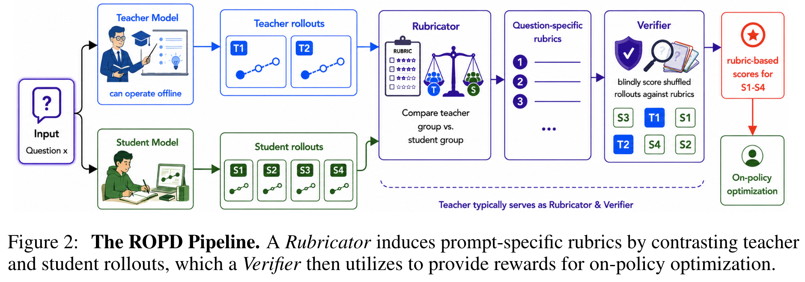
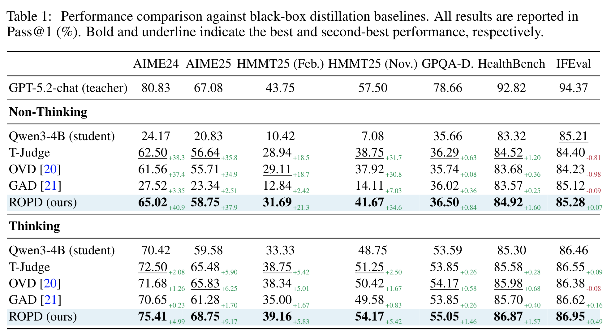

# Rubric-based On-policy Distillation

import Tabs from '@theme/Tabs';
import TabItem from '@theme/TabItem';

[Rubric-based On-policy Distillation](https://arxiv.org/abs/2605.07396) 关注一个很现实的模型对齐问题：如果一个强 teacher model 只通过 API 暴露文本输出，不提供 logits、hidden states 或 tokenizer 对齐信息，我们还能不能做 On-policy Distillation？

论文的核心观点是：传统 OPD 过度依赖 token-level logits，但对于复杂推理任务来说，logits 不一定是最好的监督信号。相比让 student 模仿 teacher 的每一步 token 分布，作者认为更有效的方式是让 teacher 抽取“什么样的答案才算好”的结构化标准，也就是 prompt-specific rubrics，然后用这些 rubrics 对 student 自己采样出来的 rollouts 打分，并作为 RL reward 训练 student。

## 论文信息

:::tip
- 论文标题：Rubric-based On-policy Distillation
- 论文链接：https://arxiv.org/abs/2605.07396
- 代码仓库：https://github.com/Peregrine123/ROPD_official
- 关键词：On-policy Distillation、Rubric-based RL、Black-box Distillation、GRPO、LLM-as-Verifier、Model Alignment
:::

## 解决的问题

On-policy Distillation（OPD）的目标是让 student 不只学习 teacher 的离线答案，而是在 student 自己生成的轨迹上得到 teacher 的反馈。这样可以缓解经典蒸馏里的 exposure bias：训练时只看 teacher-forced 轨迹，推理时却要面对 student 自己的错误前缀。

但是现有 OPD 方法通常有一个强假设：teacher 是白盒的，训练时可以访问 teacher 对每个 token 的概率分布。

这带来几个限制：

1. 很多最强模型是闭源 API，只给文本，不给 logits。
2. teacher 和 student 如果 tokenizer、架构或推理风格不同，token-level 对齐本身就很麻烦。
3. 对复杂推理任务来说，高 teacher likelihood 不一定等于答案正确，模型可能只是学到 teacher 的表述习惯。

论文要回答的问题就是：能不能保留 OPD 的 on-policy 优势，但不依赖 teacher logits？

作者给出的答案是 ROPD：Rubric-based On-policy Distillation。

## 核心思路

ROPD 的基本直觉很简单：让 teacher 不再输出 token-level 概率，而是输出一套“可验证的评分标准”。

对于同一个问题 $x$，系统会采样多条 teacher responses 和多条 student rollouts。然后让一个 Rubricator 对比这两组答案，总结出当前问题下的关键评分标准，例如：

- 是否明确给出最终答案。
- 是否识别关键约束。
- 中间推导是否逻辑连贯。
- 是否避免幻觉式数值猜测。
- 是否满足题目要求的输出格式。

之后 Verifier 会按照这些标准逐条检查 student rollout，得到一个 weighted pass rate。这个分数就作为 GRPO 的 reward，用来更新 student policy。

可以把它理解为：传统 logit-based OPD 在教 student “teacher 下一步更可能说什么”，而 ROPD 在教 student “一个好答案应该满足哪些条件”。

## 方法设计

ROPD 的 pipeline 分成三个关键环节：rubric induction、rubric-based verification 和 on-policy optimization。

<Tabs defaultValue="rubric-induction">
<TabItem value="rubric-induction" label="Rubric Induction">

对于每个 prompt $x$，先采样 $m$ 条 teacher answers 和 $n$ 条 student rollouts：

$$
y_j^T \sim \pi_T(\cdot \mid x), \quad y_i^S \sim \pi_\theta(\cdot \mid x)
$$

然后 Rubricator 根据 question、teacher responses 和 student responses 生成一组 prompt-specific rubrics。

> 这个 prompt-specific rubrics 是 online 生成的，可能会存在不稳定性。
> 
> 但模型在语义一致性上的理解较为稳定。

$$
\mathcal{C}_x = \{c_k\}_{k=1}^{K}
$$

每个 rubric item 包含两个部分：

- $\rho_k$：一条可二值判断的文本标准。
- $w_k$：该标准的重要性权重。

这里有一个重要设计：***`同一个 prompt 下的所有 student rollouts 共享同一组 rubrics。这样 GRPO 在同一个 rollout group 内比较 reward 时，评分标准是一致的，不会出现每条答案各用各的尺子。`***

</TabItem>
<TabItem value="verification" label="Rubric Verification">

Verifier 会对每条 student rollout 逐项判断是否满足 rubric：

$$
v_{i,k} = \mathrm{Verifier}(x, y_i^S, c_k), \quad v_{i,k}\in\{0,1\}
$$

最终 response-level reward 是加权通过率：

$$
s_i = \frac{\sum_{k=1}^{K} w_k v_{i,k}}{\sum_{k=1}^{K} w_k + \epsilon}
$$

这个分数比单一 scalar judge 更有解释性。它不仅告诉模型“这条答案好不好”，还把好坏拆成多个可学习方向，比如 task completion、observable quality、general reasoning。

:::success Insight
此时 Reward 比 OPD 更离散，比标准的 GRPO 更稠密，取了一个中间状态。
:::

</TabItem>
<TabItem value="optimization" label="GRPO Optimization">

论文使用 GRPO 来做 on-policy 更新。对于同一个 prompt，student 采样一组 rollouts，Verifier 给每条 rollout 一个 rubric reward，然后在组内归一化得到 advantage：

$$
A_i = \frac{r_i - \mathrm{mean}(\{r_j\})}{\mathrm{std}(\{r_j\}) + \epsilon}
$$

之后用 clipped policy optimization 更新 student。这里不需要 value model，也不需要访问 teacher logits；teacher、Rubricator 和 Verifier 都可以只通过文本 API 工作。

这也是 ROPD 相比 logit-based OPD 最重要的工程优势：teacher 可以离线运行，训练 loop 不需要把 teacher 模型挂在 GPU 上。

</TabItem>
</Tabs>

### AUC 指标设计：如何评价 reward 信号是否有效

论文里除了看最终 benchmark 分数，还专门用 AUC 来分析一个更底层的问题：`rubric reward` 和 `teacher logprob` 这两种监督信号，到底谁更能判断 student rollout 的真实正确性。

这里的 AUC 可以理解为一个排序能力指标。给定一批 student responses，每条 response 都有两个信息：

1. ground-truth correctness：这条答案最终是否正确，记为 $z_i\in\{0,1\}$。
2. 某种 reward signal：例如 rubric reward、teacher logprob 或 top-token overlap，记为 $q_i$。

如果一个 reward signal 是好的，那么正确答案的 $q_i$ 应该普遍高于错误答案。AUC 衡量的就是这种排序关系：

$$
\mathrm{AUC} = \Pr(q^+ > q^-)
$$

其中 $q^+$ 表示正确答案的信号分数，$q^-$ 表示错误答案的信号分数。直观来说，AUC 等于“随机抽一条正确答案和一条错误答案，reward signal 能把正确答案排在前面的概率”。

因此 AUC 的解释很直接：

| AUC 值 | 含义 |
| --- | --- |
| 接近 1.0 | 信号几乎总能把正确答案排在错误答案前面 |
| 接近 0.5 | 信号和随机排序差不多，基本没有区分能力 |
| 低于 0.5 | 信号方向可能反了，错误答案反而更容易得高分 |

论文用这个指标来比较两种方法的 reward quality，而不是直接比较最终模型分数。具体做法是：在同一批 AIME24 student rollouts 上，分别计算每条回答的 `rubric reward` 和 `teacher logprob`，再用真实答案正确性作为 label，计算两种信号各自的 AUC。

结果很关键：rubric reward 的 AUC 约为 0.90，而 teacher logprob 的 AUC 约为 0.35。这说明 rubric reward 更像是在评价“答案是否真的正确”，而 teacher logprob 很多时候只是在评价“这段文本是否像 teacher 会写出来的 token 序列”。

所以 AUC 在论文中的作用，是把 ROPD 和 logit-based OPD 的差异拆到 reward signal 层面：如果 reward 本身和 correctness 更对齐，那么即使它不是 dense token-level signal，也可能比 logits 更适合训练复杂推理能力。

## 与传统 OPD 的差异

ROPD 不是简单地把 teacher logits 替换成一个 LLM judge 分数，而是把监督信号从 token-level imitation 转成了 criterion-level semantic guidance。

| 方法 | Teacher 产物 | 监督信号 | 主要问题 |
| --- | --- | --- | --- |
| SFT Distillation | teacher 文本答案 | 静态 teacher outputs | 离线模仿，不能针对 student 自身错误给反馈 |
| Logit-based OPD | teacher logits | token-level probability | 需要白盒 teacher，容易鼓励表述模仿 |
| Scalar Judge RL | teacher 或 judge 打分 | 单一 response score | 信号过粗，难定位答案为什么好或坏 |
| ROPD | teacher 文本答案 | prompt-specific rubrics + weighted pass rate | 依赖 Rubricator/Verifier 的稳定性 |

这篇论文最有意思的地方在于，它挑战了一个直觉：更密集的 token-level 信号不一定更好。对于数学、科学、医学这类复杂推理任务，答案质量往往不是由“token 像不像 teacher”决定，而是由关键推理节点是否成立决定。

## 实验设置

论文在黑盒和白盒两类场景都做了评测。

### 黑盒场景

黑盒设置中，teacher 是 `GPT-5.2-chat-latest`，student 主要是 `Qwen3-4B`。ROPD 只访问 teacher 的文本输出，不访问任何 logits。

对比方法包括：

- SFT：用预采样 teacher outputs 做静态监督。
- T-Judge：直接让 teacher 作为 judge 给 response 打分。
- OVD：On-policy Verbal Distillation。
- GAD：用 discriminator 形式构造黑盒蒸馏 reward。

评测 benchmark 包括 AIME 24/25、HMMT 25、GPQA-Diamond、HealthBench 和 IFEval。

### 白盒场景

白盒设置中，teacher 是 `Qwen3-30B-A3B`，student 是 `Qwen3-4B`。虽然 teacher 是开源模型，可以访问 logits，但 ROPD 仍然只使用文本输出，以验证 rubric signal 是否能和 logit-based 方法竞争。

对比方法包括：

- LOPD：传统 logit-based OPD。
- ExOPD：通过 reward extrapolation 增强的 OPD 方法。

训练层面，所有 RL 方法都使用 GRPO，学习率为 $10^{-6}$，每个 prompt 采样 $n=8$ 条 student rollouts。ROPD 每个 prompt 采样 $m=4$ 条 teacher answers，并生成 $K\in[4,12]$ 条 rubric items。

## 关键结果

### 黑盒蒸馏中，ROPD 整体领先

在黑盒设置下，ROPD 在论文报告的 14 个 benchmark 配置中都取得第一。

比较典型的结果是：

- 在 non-thinking 模式下，Qwen3-4B 在 AIME24 上是 24.17，ROPD 提升到 65.02。
- 在 non-thinking 模式下，HMMT25 Nov. 从 7.08 提升到 41.67。
- 在 thinking 模式下，AIME25 从 59.58 提升到 68.75，甚至略高于论文中的 GPT-5.2 teacher 的 67.08。
- IFEval 上没有出现明显灾难性遗忘，说明 rubric-based distillation 不只是提升数学能力，也相对保持了通用 instruction following。

这说明 ROPD 不只是“能在黑盒条件下工作”，而是在复杂推理任务上能比已有黑盒蒸馏方法更有效。

### 白盒场景中，文本 rubric 也能超过 logits

更反直觉的是白盒实验。即便 teacher logits 可用，ROPD 仍然超过了 logit-based OPD。

论文报告中，Qwen3-4B student 在四个数学 benchmark 的平均分是 15.63，LOPD 提升到 32.82，ExOPD 提升到 35.25，而 ROPD 提升到 45.87。

作者用 student-teacher gap 来解释：LOPD 只弥合了约 42.1% 的差距，而 ROPD 弥合了约 74.1%。也就是说，ROPD 用更少的 teacher 内部信息，反而提取出了更有用的训练信号。

### 样本效率和训练效率更高

ROPD 在样本效率上也明显更好。论文报告，在 AIME24 上达到 LOPD 最佳性能时，ROPD 只需要约 1.6K samples，而 LOPD 需要约 15.4K samples，相当于接近 $10\times$ 的样本效率提升。

尽管 ROPD 每一步需要额外调用 Rubricator 和 Verifier，单步开销更大，但整体 wall-clock 仍然更快。论文报告达到同等性能阈值时，ROPD 大约需要 5.5 小时，而 LOPD 需要 34.4 小时，约为 $6.3\times$ 加速。

原因也比较直观：logit-based OPD 的 teacher 必须参与训练 loop，并且 ***token-level 信号很多是表述噪声***；ROPD 的 teacher 可以离线输出 rubric 和验证结果，且 reward 更直接指向任务正确性。

## 为什么 rubric 比 logits 更有效

论文对这个问题做了比较细的分析。最核心的发现是：teacher logprob 和答案正确性之间并不总是正相关。

在 AIME24 的分析池上，作者比较了三类信号和 ground-truth correctness 的对齐程度：

| 信号 | 含义 | 与正确性的关系 |
| --- | --- | --- |
| Rubric reward | 按 prompt-specific rubric 得到的加权通过率 | AUC 约 0.90，能明显区分正确和错误回答 |
| Teacher logprob | teacher 对 student answer 的 token likelihood | AUC 约 0.35，接近甚至低于随机 |
| Top-24 overlap | student token 是否落入 teacher top tokens | 动态范围很小，容易饱和 |

这说明在复杂推理任务里，teacher likelihood 可能更像是“这个答案是否像 teacher 会写出来的文本”，而不是“这个答案是否正确”。

一个正确答案可能采用不同推理路径或不同表述方式，因此 logprob 不一定高；反过来，一个错误答案可能语言流畅、格式熟悉、局部推导像 teacher，因此 logprob 反而不低。

ROPD 的优势在于把评价维度拆开：

1. Task Completion：是否完成题目并给出最终答案。
2. Observable Quality：是否有可观察的关键正确性证据。
3. General Reasoning：推理过程是否连贯、清晰、自洽。

这种拆分让 reward 更像一个可训练的错误定位器，而不是一个黑盒偏好分数。

## 消融实验

论文把 ROPD 的几个关键设计拆开做了 ablation。

| 设计 | AIME24 Pass@1 | 说明 |
| --- | --- | --- |
| Qwen3-4B base | 24.17 | 原始 student |
| 去掉 multi-teacher，只用 1 条 teacher answer | 47.08 | rubric 容易过拟合单一路径 |
| 去掉 shared rubric，每条 student 单独生成 rubric | 61.25 | 组内比较标准不统一 |
| 去掉 blind scoring，让 Verifier 看到身份 | 61.75 | 容易引入 identity bias |
| Full ROPD | 65.02 | 完整方法最好 |

这里最重要的结论是 multi-teacher coverage。只用一条 teacher answer 会让 rubric 退化成“匹配某个 teacher 的路径”，而不是抽取通用正确性标准。多个 teacher answers 能帮助 Rubricator 区分“必要的推理质量”和“某个答案的偶然写法”。

shared rubric 也很关键。同一个 prompt 下，所有 student rollouts 共享一套 rubrics，才能让 GRPO 的 group-relative advantage 有一致含义。如果每条 rollout 都用不同 rubric，reward 之间就不再可比。

blind scoring 的作用是减少身份偏置。Verifier 不应该因为知道某条答案来自 teacher 或 student 而改变判断，但保留 teacher responses 作为同一评测池里的难度锚点，有助于校准不同问题的 reward spread。

## 与 Rubric-based RL 的关系

这篇论文可以放在 rubric-based RL 这条线里理解，但它和 RaR、OpenRubrics、Rubicon 等工作的侧重点不同。

已有 rubric-based RL 往往把 rubric 当作评价工具：先有题目、标准或参考答案，然后用 rubric 衡量 response quality。ROPD 则把 rubric 当作蒸馏接口：rubric 不是静态写死的，而是从 teacher-student contrast 中生成，用来表达 teacher 相比 student 的关键能力差距。

换句话说，<u>***ROPD 不只是“用 rubric 做 reward”，而是“用 rubric 传递 teacher knowledge”。***</u>

这点对于闭源 teacher 特别重要。闭源模型不给 logits，但它可以通过文本生成：

- 多条高质量参考答案。
- 一组可验证的评价标准。
- 对 student rollout 的逐项判断。

这些文本接口就足够构成一个 on-policy distillation loop。

## 局限性

论文也提到 ROPD 仍有几个明显限制。

1. 实验主要集中在数学、科学和医学推理任务上。虽然 IFEval 结果显示 instruction following 没有明显退化，但在更主观、更开放的创意写作、对话风格、复杂偏好对齐任务上，rubric-based OPD 是否同样稳定还需要验证。

2. ROPD 依赖 Rubricator 和 Verifier 的 instruction following 能力。如果 rubric 写得太泛、太偏向格式，或者 Verifier 容易被表面流畅性欺骗，reward 仍然会被污染。

3. rubric reward 也存在被 exploit 的可能。论文附录提到，少数情况下 student 会学到一些看似满足 rubric 但实质错误的回答模式，比如格式技巧或关键词堆砌。虽然作者观察到这类问题在训练后期会被更明确的 correctness checks 修正，但这仍然是 rubric-based RL 需要长期关注的问题。

## 作者的思考

ROPD 最有价值的地方，是把“蒸馏”从 token 模仿推进到了语义规则传递。

传统知识蒸馏很容易被理解成：student 要尽量像 teacher。但对于推理模型来说，这个目标本身可能不够准确。一个真正有用的 student 不一定要复现 teacher 的措辞、token 分布或具体解题路径，它更应该学到 teacher 背后的判别标准：哪些步骤是必要的，哪些约束不能漏掉，哪些结论必须被验证。

ROPD 用 rubric 把这些隐性的判别标准显式化了。这个设计有点像把 teacher 从“答案提供者”变成“教练”：它不只是给一个参考答案，而是指出一个好答案应该满足哪些条件，并对 student 的尝试逐项反馈。

这对 Agent 和模型对齐也有启发。很多真实任务没有简单的 exact match reward，例如写报告、做研究、生成代码方案、完成办公文档。对于这些任务，最重要的不是让模型复刻某个参考输出，而是让模型学会满足一组领域质量标准。ROPD 展示了一种可扩展的路径：让强模型帮助生成和验证这些标准，再把它们变成 RL reward。

当然，这也意味着未来的关键问题会从“有没有 reward”变成“rubric 是否可靠”。rubric 的覆盖度、可验证性、抗投机性和跨任务稳定性，可能会成为 rubric-based RL 能否真正规模化的核心。

## 总结

ROPD 是一个面向黑盒 teacher 的 on-policy distillation 框架。它用 prompt-specific rubrics 替代 teacher logits，让 teacher 通过文本方式提供结构化语义监督，再用 Verifier 计算 weighted pass rate，并通过 GRPO 训练 student。

论文最重要的结论是：对于复杂推理任务，token-level logits 并不一定是最有效的蒸馏信号。相比模仿 teacher 的 token 分布，学习“一个好答案应该满足哪些标准”可能更高效、更稳健，也更适合闭源模型和跨架构蒸馏场景。
