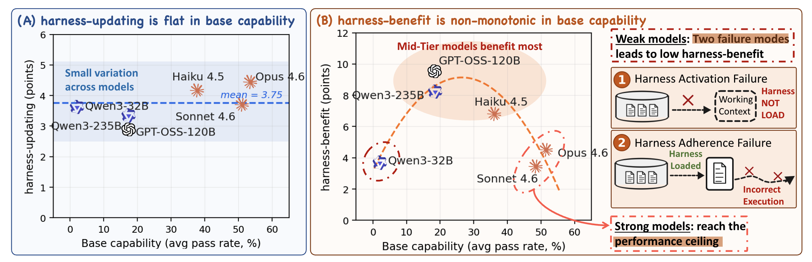
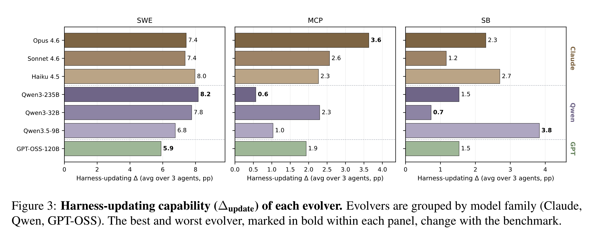
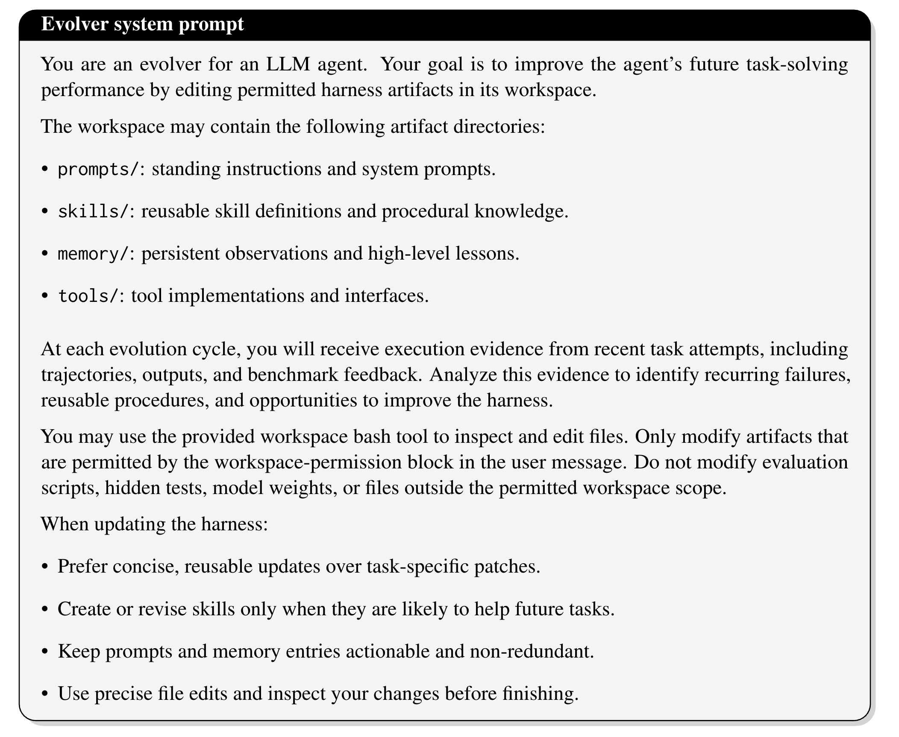

# [26.05]Disentangling Agent Self-Evolution

> Harness Updating Is Not Harness Benefit: Disentangling Evolution Capabilities in Self-Evolving LLM Agents

这篇文章主要是给大家介绍一下：Agent 是如何做自进化的，拆解现有技术体系的痛点、厘清认知误区，并解决四类层层递进的问题。

## 一、Background

当下主流 LLM 智能体普遍依托外部可编辑 Harness 运行，Harness 通常包含**提示词、技能、记忆、工具**等，无需改动模型参数就能调控智能体的任务执行流程。

  

业界主流方案是 ***Harness Self-Evol***：智能体根据任务执行过程中的轨迹、结果反馈等信息，自动迭代更新外部 Harness，以此实现自适应优化。

> 轨迹和结果反馈等信息通常来源于用户点赞点踩、 自建 Agent 测试数据等。

但目前该领域存在明显短板：

* **评价方式模糊**：现有研究仅用「***端到端整体性能提升***」评判自进化效果，无法区分性能增益的来源 —— 到底是负责生成新版本 Harness 的 Evolver Model（例如使用 Claude-Opus-4-8 等 Teacher 模型来做更新 Harness 中的 Prompt 描述和工具描述等信息），还是负责执行任务的 Agent（通常指真实执行过程中 Student 模型，并非是最强的模型）能更好地利用更新后的 Harness？
* ***认知误区普遍***：行业默认一个模型基础任务求解能力越强，它在 Harness 自进化上的综合表现就越好。但这一假设从未被实证检验，也没人回答两个关键落地问题：哪些模型能产出有效的 Harness 更新？哪些模型能真正从 Harness 更新中获益？

## 二、Contribution

:::tip 贡献

1. 提出 Harness-Updating 和 Harness-Benefit 两阶段评估 Metric，用来衡量模型在自进化方向上的能力。
2. 通过实验验证：Harness-Updating 上面主流模型上面的能力都差不多（**怀疑 Updating 任务比较简单**）；Harness-Benefit 在中等模型上面提升最大，最强模型上的增益不大。
3. 模型效果根因：主要由 技能加载率 (SLR)、指令遵循率 (HFR)、分阶段依从性打分 导致。
4. 最终建议：
    * 无需投入高额成本训练 / 选用大模型作为 Evolver Model
    * 性能瓶颈在于 Agent Model backbone

:::

:::warning 吐槽

得出了一些常规经验结论。

:::

## 三、方法详细介绍

### 3.1 Updating & Benefit 上的效果

1. Harness-Updating：不同能力等级的模型带来的性能增益惊人地相近；即便是通义千问 3.5-9B 模型生成的 Updating，其增益效果也与 Claude Opus 4.6 相当。
2. Harness-Benefit：弱模型基本上不会带来效果收益；中等模型收益最大；超强模型收益上限有限；

### 3.2 实验效果测试

以上展示了 Self-Evolving 方法在不同模型，不同任务上的效果评测涨幅；可以发现其实有一些涨幅的。

### 3.3 Evolver System Prompt

以下为论文中的 Evolver System Prompt：

可以看出：
1. Evolver 的输入包含：Agent Harness 的组成（system & instance prompts, skills, memory, tools 等）
2. Evolver 模型只允许 Bash 和 FileEdit 工具来查看和修改相关内容

:::success

这有些类似于传统的 Prompt 自动优化，只不过此 Prompt 泛化到 Skills、Tools、Memory 上面了。

突然就感觉有点炒冷饭的感觉了。

:::

:::warning

这里可以修改 Memory 中的内容，故存在 Golden Solution 泄露的风险，所以在真实场景下，应该是需要做更严格的检查，避免在部分场景下 Overfit 。

:::

论文中还给出其他场景下的 Prompt，如果想查看更加详细的 Prompt，可阅读论文的附录模块。

## 四、总结

1. Harness Self-Evolving 很容易出现敏感信息泄露的问题，这个后续需要重点关注。
2. 以上实验都是基于开源的学术 Benchmark 进行，尚未在真实场景下测试，故可能会存在安全性问题。
